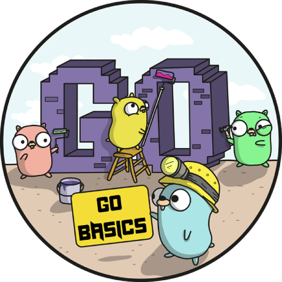

# Chương 1. Language Foundation

	
	 
	
		<i></i>
	

 

>*“Go is no Erlang, Smalltalk or Scheme, nothing pure. But it works great and is fun!” – Frank Mueller (@themue)"*

Chương này bắt đầu bằng vài lời giới thiệu về lịch sử của ngôn ngữ Go và phân tích chi tiết cuộc cách mạng của chương trình "Hello World" với những thế hệ ngôn ngữ đi trước. Sau đó, một số cấu trúc dữ liệu sẽ được trình bày như `arrays`, `strings`, và `slices`, tính chất `process-oriented` và `duck typing` được thể hiện qua `functions`, `methods`, và `interfaces`, đặc biệt là mô hình `concurrent programming` và `error handling` cũng được giới thiệu sơ qua. Cuối cùng, một số trọng tâm trong việc phát triển chương trình trên các nền tảng macOS, Windows, và Linux, cũng như một vài editor và môi trường phát triển tích hợp (IDE) cũng được đề cập, bởi vì có công cụ tốt thì năng suất làm việc mới tăng lên.

Tài liệu này được là một trong những quyển sách nâng cao về Golang, vì vậy người đọc cần có một nền tảng Golang nhất định. Nếu bạn không biết nhiều về Golang, các bạn nên học Golang với một số gợi ý sau:

- Sau khi cài đặt Golang và tải hướng dẫn bằng `go get golang.org/x/tour`, có thể xem hướng dẫn [A Tour of Go](https://tour.golang.org/welcome/1) ngay ở local bằng lệnh `tour`.
- Bạn cũng có thể đọc hướng dẫn ["Ngôn ngữ lập trình Go"](http://www.gopl.io/) được xuất bản bởi team Golang chính thức . ["Ngôn ngữ lập trình Go"](http://www.gopl.io/)  được gọi là *Kinh thánh* Golang trong cộng đồng Golang mà bạn phải đọc thật bài bản.

Trong khi học, hãy cố gắng giải quyết một số vấn đề nhỏ với Golang. Nếu bạn muốn tham khảo API, có thể mở truy vấn tài liệu tích hợp bằng lệnh `godoc`.
