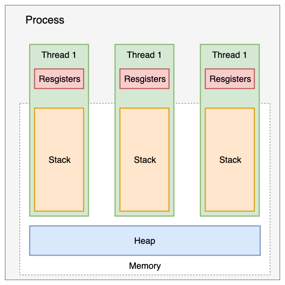
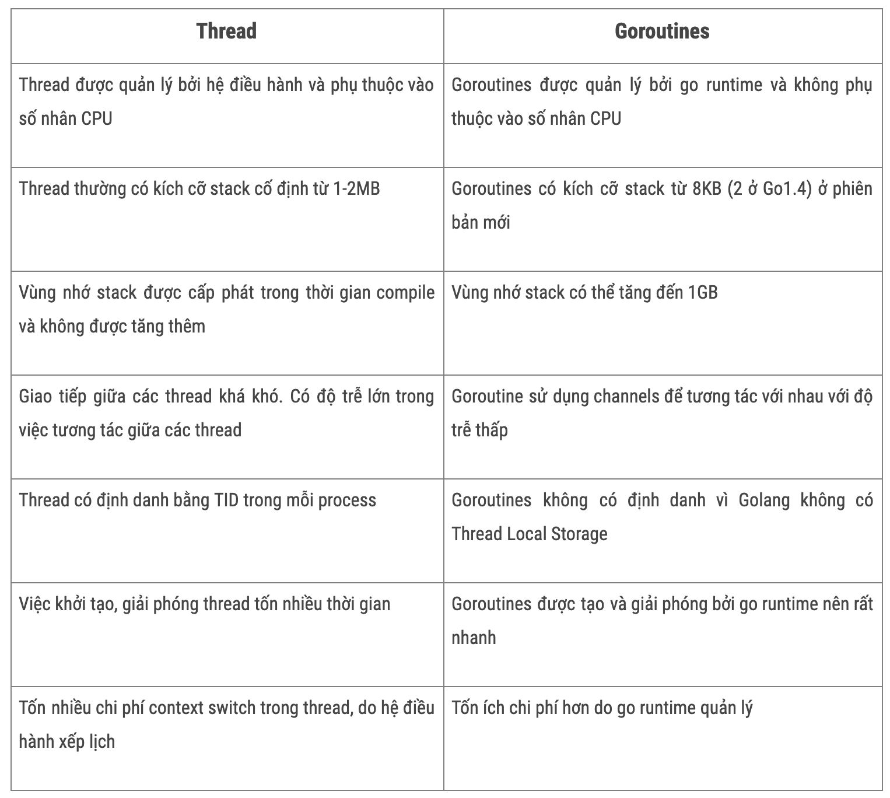

# 1.5. Mô hình lập trình đồng thời và lập trình song song

Thời gian đầu, CPU chỉ có một nhân duy nhất, các ngôn ngữ khi đó sẽ theo mô hình lập trình tuần tự, điển hình là ngôn ngữ C. Ngày nay, với sự phát triển của công nghệ đa xử lý, để tận dụng tối đa sức mạnh của CPU, mô hình lập trình song song hay [multi-threading](https://en.wikipedia.org/wiki/Multithreading_(computer_architecture)) thường thấy trên các ngôn ngữ lập trình ra đời. Ngôn ngữ Go cũng phát triển mô hình lập trình đồng thời rất hiệu quả với khái niệm Goroutines.

Lập trình tuần tự|Lập trình song song
---|---
 | 

Ở phần này chúng ta sẽ đi tìm hiểu về mô hình lập trình đồng thời trong Golang như thế nào. Trước hết chúng ta cùng nhắc lại một số kiến thức liên quan đến xử lý đồng thời và xử lý song song (parallelism).

## 1.5.1 Xử lý đồng thời là gì ?

Xử lý đồng thời là khả năng phân chia và điều phối nhiều tác vụ khác nhau trong cùng một khoảng thời gian và tại một thời điểm chỉ có thể xử lý một tác vụ. Khái niệm này trái ngược với **xử lý tuần tự** (sequential processing). Xử lý tuần tự là khả năng xử lý chỉ một tác vụ trong một khoảng thời gian, các tác vụ sẽ được thực thi theo thứ tự hết tác vụ này sẽ thực thi tiếp tác vụ khác.

>*Concurrency is about **dealing** with lots of things at once-Rob Pike*

Ví dụ như chúng ta vừa muốn nghe nhạc vừa đọc [Advanced Go book](https://zalopay-oss.github.io/go-advanced/) và trong lúc đọc bạn muốn tải bộ tài liệu về từ [zalopay-oss](https://github.com/zalopay-oss/go-advanced). Nếu như theo mô hình xử lý tuần tự thì trìng duyệt web sẽ phải thực hiện việc nghe nhạc xong, rồi tới việc mở  [Advanced Go book](https://zalopay-oss.github.io/go-advanced/) online để đọc và sau khi đọc xong chúng ta mới có thể tải về được. Đối với mô hình xử lý đồng thời thì ta có thể làm 3 tác vụ trên trong cùng một khoảng thời gian. Chúng ta có thể vừa nghe nhạc vừa lướt đọc tài liệu mà vừa có thể tải bộ tài liệu này về máy. *Vậy làm thế nào để có thể xử lý đồng thời như vậy ?*

Tất cả các chương trình đang chạy trong máy tính chúng ta chạy đều do hệ điều hành quản lý, với mỗi chương trình đang chạy như vậy được gọi là một `process` (tiến trình) và được cấp một `process id` (PID) để hệ điều hành dễ dàng quản lí. Các tác vụ của tiến trình sẽ được `CPU core` (nhân CPU) của máy tính xử lý. Vậy làm sao 1 máy tính có CPU 1 nhân có thể làm được việc xử lý đồng thời nhiều tác vụ của các tiến trình cùng lúc. Bởi vì bản chất tại một thời điểm nhân CPU chỉ có thể xử lý một tác vụ.

Như câu nói của Rob Pike, ông đã sử dụng từ **dealing** (phân chia xử lý) để nói đến khái niệm concurrency. Thật như vậy, nhân CPU không bao giờ đợi xử lý xong một tác vụ rồi mới xử lý tiếp tác vụ khác, mà nhân CPU đã chia các tác vụ lớn thành các tác vụ nhỏ hơn và sắp xếp xen kẽ lẫn nhau. Nhân CPU xẽ tận dụng thời gian rảnh của tác vụ này để đi làm tác vụ khác, một lúc thì làm tác vụ nhỏ này, một lúc khác thì làm tác vụ nhỏ khác. Như vậy chúng ta sẽ cảm thấy máy tính xử lý nhiều việc cùng lúc tại cùng thời điểm. Nhưng bản chất bên dưới nhân CPU thì nó chỉ có thể thực thi một tác vụ nhỏ trong tác vụ lớn tại thời điểm đó.

<div align="center">
    
    <br/>
        <span align="center"><i>Chia nhỏ tác vụ và xử lý trong mô hình concurrency</i></span>
    <br/>
</div>

<div align="center">
    
    <br/>
        <span align="center"><i>Mô hình xử lý tuần tự</i></span>
    <br/>
</div>

## 1.5.2 Xử lý song song là gì ?

Xử lý song song là khả năng xử lý nhiều tác vụ khác nhau trong cùng một thời điểm, các tác vụ này hoàn toàn độc lập với nhau. Xử lý song song chỉ có thể thực hiện trên máy tính có số nhân lớn hơn 1. Thay vì một nhân CPU chúng ta chỉ có thể xử lý một tác vụ nhỏ tại một thời điểm thì khi số nhân CPU có nhiều hơn chúng ta có thể xử lý các tác vụ song song với nhau cùng lúc trên các nhân CPU.

>*Parallelism is about **doing** lots of things at once-Rob Pike*

Cũng lấy ví dụ nghe nhạc, đọc tài liệu và tải tài liệu ở trên, thì trong mô hình xử lý song song sẽ như sau.

<div align="center">
    
    <br/>
        <span align="center"><i>Mô hình xử lý song song các tác vụ cùng một thời điểm</i></span>
    <br/>
</div>

Trong thực tế, trên mỗi nhân của CPU vẫn xảy ra quá trình xử lý đồng thời miễn là tại một thời điểm không có xảy ra việc xử lý cùng một tác vụ trên hai nhân CPU khác nhau, mô hình trên vẽ lại như sau:

<div align="center">
    
    <br/>
        <span align="center"><i>Mô hình xử lý song song</i></span>
    <br/>
</div>

 Chúng ta nên nắm được mô hình xử lý đồng thời khác với mô hình xử lý song song, tuy hai mô hình đều nêu lên việc xử lý nhiều tác vụ trong cùng một thời điểm. Trong một bài diễn thuyết của Rob Pike, ông cũng đã trình bày và phân biệt hai mô hình trên. Các bạn có thể xem buổi diễn thuyết [ở đây](https://blog.golang.org/concurrency-is-not-parallelism).

 ## 1.5.3 Xử lý đồng thời trong Golang
 Trước khi tìm hiểu về cách Golang xử lý đồng thời như thế nào, chúng ta cùng nhắc lại một số khái niệm về tiến trình (process) và luồng (thread) trong hệ điều hành.

### Process 
Tiến trình có thể hiểu đơn giản là một chương trình đang chạy trong máy tính. Khi chúng ta mở trình duyệt web để đọc [Advanced Go book](https://zalopay-oss.github.io/go-advanced/) thì đây được xem là một tiến trình. Khi chúng ta viết 1 chương trình máy tính bằng ngôn ngữ lập trình như C, Java, hay Go, sau khi tiến hành biên dịch và chạy chương trình thì hệ điều hành sẽ cấp cho chương trình một không gian bộ nhớ nhất định, PID (process ID),... Mỗi tiến trình có ít nhất một luồng chính (main thread) để chạy chương trình, nó như là xương sống của chương trình vậy. Khi luồng chính này ngừng hoạt động tương ứng với việc chương trình bị tắt.


### Thread
Thread hay được gọi là tiểu trình nó là một luồng trong tiến trình đang chạy. Các luồng được chạy song song trong mỗi tiến trình và có thể truy cập đến vùng nhớ được cung cấp bởi tiến trình, các tài nguyên của hệ điều hành,...

<div align="center">
    
    <br/>
        <span align="center"><i>Mô hình xử lý song song</i></span>
    <br/>
</div>

Các thread trong process sẽ được cấp phát riêng một vùng nhớ `stack` để lưu các biến riêng của thread đó. Stack được cấp phát cố định khoảng `1MB-2MB`. Ngoài ra các thread chia sẻ  chung vùng nhớ `heap` của process. Khi process tạo quá nhiều thread sẽ dẫn đến tình trạng [stack overflow](https://en.wikipedia.org/wiki/Stack_overflow). Khi các thread sử dụng chung vùng nhớ sẽ dễ gây ra hiện tượng [race condition](https://en.wikipedia.org/wiki/Race_condition). Ở phần sau chúng ta sẽ tìm hiểu cách Golang xử lý như thế nào để tránh lỗi race condition.

Ở các phần trên chúng ta đã cùng nhau thảo luận về mô hình xử lý đồng thời và xử lý song song các tác vụ, các tác vụ ở đây sẽ được thực hiện bởi các thread khác nhau. Vì vậy tương quan ở đây là khi chúng ta xử lý các tác vụ theo mô hình đồng thời hay song song cũng có nghĩa là có nhiều thread chạy đồng thời hay song song (multi-threading). Số lượng thread chạy song song trong cùng một thời điểm sẽ bằng với số lượng nhân CPU mà máy tính chúng ta có. Vì vậy khi chúng ta lập trình mà tạo quá nhiều thread thì cũng không có giúp cho chương trình chúng ta chạy nhanh hơn, mà còn gây ra lỗi và làm chậm chương trình. Theo kinh nghiệm lập trình chúng ta chỉ nên tạo số thread bằng số `nhân CPU * 2`.

Như mình đã trình bày ở phần trên thì khi xử lý đồng thời thì tại một thời điểm chỉ có một tác vụ được xử lý hay một thread được chạy trên một nhân CPU. Khi nhân CPU chuyển qua xử lý tác vụ khác cũng có nghĩa là thread khác được chạy. Thao tác đó được gọi là `context switch`. Các bạn có thể xem chi tiết [ở đây](https://en.wikipedia.org/wiki/Context_switch). 

### Goroutines và system threads

Goroutines là một đơn vị concurrency của ngôn ngữ Go. Hay nói cách khác Golang sử dụng goroutine để xử lý đồng thời nhiều tác vụ. Việc khởi tạo goroutines sẽ ít tốn chi phí hơn khởi tạo `thread` so với các ngôn ngữ khác. Cách khởi tạo goroutine chỉ đơn giản thông qua từ khóa `go`. Về góc nhìn hiện thực, `goroutines` và `thread` không giống nhau.

Đầu tiên, system thread sẽ có một kích thước vùng nhớ stack cố định (thông thường vào khoảng 2MB). Vùng nhớ stack chủ yếu được dùng để lưu trữ những tham số, biến cục bộ và địa chỉ trả về khi chúng ta gọi hàm.

Kích thước cố định của stack sẽ dẫn đến hai vấn đề:
  * Stack overflow với những chương trình gọi hàm đệ quy sâu.
  * Lãng phí vùng nhớ đối với chương trình đơn giản.


Giải pháp cho vấn đề này chính là cấp phát linh hoạt vùng nhớ stack:
  * Một Goroutines sẽ được bắt đầu bằng một vùng nhớ nhỏ (khoảng 2KB hoặc 4KB).
  * Khi gọi đệ quy sâu (không gian stack hiện tại là không đủ) Goroutines sẽ tự động tăng không gian stack (kích thước tối đa của stack có thể được đạt tới 1GB).
  * Bởi vì chi phí của việc khởi tạo là nhỏ, chúng ta có thể dễ dàng giải phóng hàng ngàn goroutines.

Với ngôn ngữ lập trình khác như Java thì các thread được quản lý bởi hệ điều hành, có nghĩa là chương trình chúng ta đang xử lý đồng thời bị phụ thuộc vào hệ điều hành. Trong Golang sử dụng [Go runtime](https://golang.org/pkg/runtime/) có riêng cơ chế định thời cho Goroutines, nó dùng một số kỹ thuật để ghép `M Goroutines` trên `N thread` của hệ điều hành. Cơ chế định thời Goroutines tương tự với cơ chế định thời của hệ điều hành nhưng chỉ ở mức chương trình. Biến `runtime.GOMAXPROCS` quy định số lượng thread hiện thời chạy trên các Goroutines. 

Chúng ta cùng xem qua bảng so sánh giữa Gorountines và Thread được tham khảo [ở đây](https://medium.com/rungo/achieving-concurrency-in-go-3f84cbf870ca): 

<div align="center">
    
    <br/>
        <span align="center"><i>Mô hình xử lý song song</i></span>
    <br/>
</div>

## 1.5.4 Ví dụ Goroutine

### Ví dụ 1:

```go
func main() {
	// sử dụng từ khoá go để tạo goroutine
	go fmt.Println("Xin chào goroutine")
	fmt.Println("Xin chào main goroutine ")
}
```

Chương trình trên có lúc in ra cả hai câu không đúng như thứ tự trên, có lúc sẽ chỉ in được mỗi câu "Xin chào main goroutin". Chúng ta đã biết khi hàm main chạy xong thì chương trình sẽ dừng. Hàm main cũng là một goroutine và chạy đồng thời với hàm `fmt.Println`. Nên có trường hợp hàm main chạy xong và dừng trước khi hàm `fmt.Println1` được chạy.

Chúng ta có thể làm như sau để có thể in ra cả hai câu:

```go
func main() {
	// sử dụng từ khoá go để tạo goroutine
	go fmt.Println("Hello from another goroutine")
	fmt.Println("Hello from main goroutine")

    // chờ 1 giây để có thể chạy được goroutine 
    //của hàm fmt.Println trước khi hàm main kết thúc
	time.Sleep(time.Second)
}
```
Sau khi chương trình chạy xong các goroutine sẽ bị huỷ.

### Ví dụ 2:

Chúng ta có thể sử dụng goroutine bằng cách sau.
```go
func MyPrintln(id int, delay time.Duration) {
	go func() {
		time.Sleep(delay)
		fmt.Println("Xin chào, tôi là goroutine: ", id)
	}()
}

func main() {
	for i := 0; i < 100; i++ {
		MyPrintln(i, 1*time.Second)
	}

	time.Sleep(10 * time.Second)
	fmt.Println("Chương trình kết thúc")
}
```

Ở phần tiếp theo chúng ta sẽ đi tới những ví dụ phức tạp hơn như cách xử lý race-condition trong Golang, sử dụng channel để chặn các goroutine,...

[Tiếp theo](ch1-06-common-concurrency-mode.md)