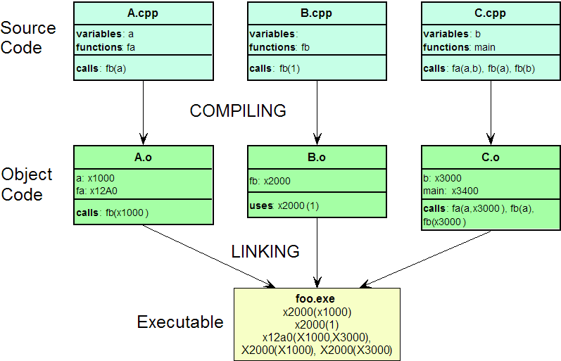

# 2.10.  Biên dịch và liên kết các tham số

Biên dịch và liên kết các parameters là một vấn đề mà các lập trình viên C/C++ thường gặp phải. Trong phần này, chúng tôi sẽ giới thiệu ngắn các bước biên dịch và link parameters thường được dùng trong CGO.

	

 

## 2.10.1. Tham số biên dịch : 

CGO cung cấp ba tham số CFLAGS/CPPFLAGS/CXXFLAGS. Trong đó:
  * **CFLAGS** sẽ ứng với việc biên dịch ngôn ngữ C (.c).
  * **CPPFLAGS** sẽ ứng với C/C++ (.c, .cc, .cpp, .cxx).
  * **CXXFLAGS** ứng với C++ thuần (.cc, .cpp, *.cxx).

## 2.10.2. Tham số liên kết :

Trong CGO `${SRCDIR}` là một đường dẫn tuyệt đối trong thư mục hiện tại, các file định dạng của đối tượng C và C++ sau khi được biên dịch là như nhau, do đó `LDFLAGS` sẽ ứng với các C/C++ link parameters.

## 2.10.3. Lệnh pkg-config

Dùng công cụ [pkg-config](https://www.ardanlabs.com/blog/2013/08/using-cgo-with-pkg-config-and-custom.html) để thuận tiện cho việc compile và link parameter:

* Lệnh `#cgo pkg-config abc` để sinh ra lệnh compile và link parameter cho thư viện `abc`.
* Lệnh `pkg-config abc --cflags` sẽ sinh ra `compiler parameters`.
* Lệnh `pkg-config abc --libs` để sinh ra  links parameters.

Có một số thư viện C/C++ non-standard mà pkg-config không hỗ trợ. Khi đó, chúng ta có thể hiện thực thủ công compilation và link parameter.

## 2.10.4. Chuỗi cài đặt package

Lệnh `go get` package sẽ liên kết các package phụ thuộc liên quan. Một chuỗi các package phụ thuộc sau như pkgA -> pkgB -> pkgC -> pkgD. Sau khi `go get A_package`, chúng sẽ get B, C, D package. Nếu việc build hỏng sau khi get package_B, nó sẽ dẫn tới việc hỏng toàn bộ chuỗi , kết quả là lệnh get package_A bị hỏng.

Sẽ có một số lý do cho việc hỏng chuỗi get, đây là một số lý do phổ biến:

* Một số hệ thống không hỗ trợ, việc biên dịch sẽ hỏng.
* Phụ thuộc vào `cgo`
  * User không có `gcc` được cài đặt sẵn.
  * Những thư viện độc lập không được cài đặt.
* Phụ thuộc vào `pkg-config`
  * Không được cài đặt trên windows.
  * Không có file `bc` được tìm thấy tương ứng.
* Phụ thuộc vào `custom pkg-config`: yêu cầu một số thiết lập thêm.
* Phụ thuộc vào `swig`: user chưa cài đặt `swig`, hoặc phiên bản không tương thích.

[Tiếp theo](ch2-11-ext.md)