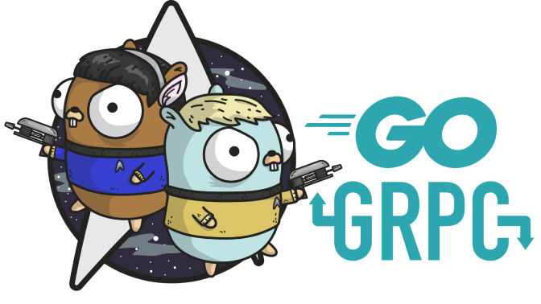

# Chương 3: Remote Procedure Call

	
	 
	
		<i></i>
	

 

>*“Go is not meant to innovate programming theory. It’s meant to innovate programming practice.” – Samuel Tesla*

Remote Procedure Call là kỹ thuật cho phép chúng ta gọi hàm từ một process khác nằm cùng một máy hoặc ở hai máy tính khác nhau. Mục tiêu chính của phương pháp này là giúp lời gọi RPC tương tự như lời gọi thủ tục thông thường và ẩn đi phần xử lý kết nối mạng phức tạp. Chương này sẽ trình bày về cách sử dụng RPC, thiết kế RPC service, và hệ sinh thái RPC được xây dựng dựa trên nền tảng Protobuf của Google.

 <a href="../ch2-cgo/ch2-11-ext.md">&lt Phần 2.11</a> 
<a href="../SUMMARY.md"> Mục lục</a>  
 <a href="ch3-01-rpc-go.md">Phần 3.1 &gt</a> 

