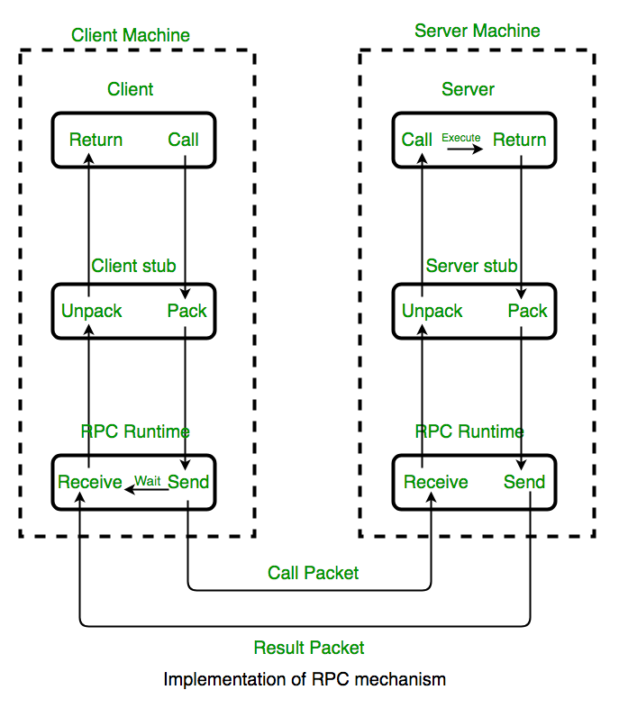

# 3.1. Giới thiệu về RPC

[Remote Procedure Call](https://en.wikipedia.org/wiki/Remote_procedure_call) (RPC) là phương pháp gọi hàm từ một máy tính ở xa để lấy về kết quả. Trong lịch sử phát triển của Internet, RPC đã trở thành một cơ sở hạ tầng không thể thiếu cũng giống như là IPC (Inter Process Communication).

<div align="center">
	
    <br/>
    <span align="center">
		<i>Mô hình giao tiếp client/server trong RPC</i>
	</span>
</div>


## 3.1.1 Chương trình RPC đầu tiên

Chương trình RPC đầu tiên được xây dựng dựa trên package [net/rpc](https://golang.org/pkg/net/rpc/) sẽ in ra chuỗi "Hello World" được tạo ra và trả về từ process khác:


***server/main.go:*** chương trình phía server.

```go
package main

import (
    "log"
    "net"
    "net/rpc"
)

// định nghĩa service struct 
type HelloService struct{}

// định nghĩa hàm service Hello, quy tắc:
// 1. Hàm service phải public (viết hoa)
// 2. Có hai tham số trong hàm
// 3. Tham số thứ hai phải kiểu con trỏ
// 4. Phải trả về kiểu error

func (p *HelloService) Hello(request string, reply *string) error {
    *reply = "Hello " + request
    // trả về error = nil nếu thành công
    return nil
}

func main() {
    rpc.RegisterName("HelloService", new(HelloService))
    // chạy rpc server trên port 1234
    listener, err := net.Listen("tcp", ":1234")
    // nếu có lỗi thì in ra
    if err != nil {
        log.Fatal("ListenTCP error:", err)
    }
    // vòng lặp để phục vụ nhiều client
    for {
        // accept một connection đến
        conn, err := listener.Accept()
        // in ra lỗi nếu có
        if err != nil {
            log.Fatal("Accept error:", err)
        }
        // phục vụ client trên một goroutine khác
        // để giải phóng main thread tiếp tục vòng lặp
        go rpc.ServeConn(conn)
    }
}
```


***client/main.go:*** chương trình phía client.

```go
package main

import (
    "fmt"
    "log"
    "net/rpc"
)

func main() {
    // kết nối đến rpc server
    client, err := rpc.Dial("tcp", "localhost:1234")
    // in ra lỗi nếu có
    if err != nil {
        log.Fatal("dialing:", err)
    }
    // biến chứa giá trị trả về sau lời gọi rpc
    var reply string
    // gọi rpc với tên service đã register
    err = client.Call("HelloService.Hello", "World", &reply)
    if err != nil {
        log.Fatal(err)
    }
    // in ra kết quả
    fmt.Println(reply)
}
```

Chạy server :

```sh
$ go run server/main.go
```

Chạy client :

```sh
$ go run client/main.go
Hello World
```

Qua ví dụ trên, có thể thấy rằng việc dùng RPC trong Go thật sự đơn giản.

## 3.1.2 Hàm giám sát bằng RPC

Ta mong muốn khi hệ thống gặp phải những điều kiện nhất định thì có thể nhận về kết quả thông báo. Ví dụ sau sẽ xây dựng phương thức `Watch` để làm điều đó.

Ý tưởng là giả lập một key-value store đơn giản, mỗi khi có sự thay đổi về value thì sẽ gửi về thông báo cho client.

<div align="center">

<br/>
<span align="center"><i>Mô hình sử dụng hàm Watch</i></span>
<br/>
<br/>
</div>

Trước tiên xây dựng cơ sở dữ liệu Key-Value đơn giản thông qua RPC, xây dựng service như sau:

```go
type KVStoreService struct {
    // map lưu trữ dữ liệu key value
    m      map[string]string

    // map chứa danh sách các hàm filter
    // được xác định trong mỗi lời gọi
    filter map[string]func(key string)

    // bảo vệ các thành phần khác khi được truy cập
    // và sửa đổi từ nhiều Goroutine cùng lúc
    mu     sync.Mutex
}

func NewKVStoreService() *KVStoreService {
    return &KVStoreService{
        m:      make(map[string]string),
        filter: make(map[string]func(key string)),
    }
}
```

Tiếp theo là phương thức Get và Set:

```go
func (p *KVStoreService) Get(key string, value *string) error {
    p.mu.Lock()
    defer p.mu.Unlock()

    if v, ok := p.m[key]; ok {
        *value = v
        return nil
    }

    return fmt.Errorf("not found")
}

func (p *KVStoreService) Set(kv [2]string, reply *struct{}) error {
    p.mu.Lock()
    defer p.mu.Unlock()

    key, value := kv[0], kv[1]

    if oldValue := p.m[key]; oldValue != value {
        // hàm filter được gọi khi value tương ứng
        // với key bị sửa đổi
        for _, fn := range p.filter {
            fn(key)
        }
    }

    p.m[key] = value
    return nil
}
```

Các filter sẽ được cung cấp trong phương thức `Watch`:

```go
// Watch trả về key mỗi khi nhận thấy có thay đổi
func (p *KVStoreService) Watch(timeoutSecond int, keyChanged *string) error {
    // id là một string ghi lại thời gian hiện tại
    id := fmt.Sprintf("watch-%s-%03d", time.Now(), rand.Int())

    // buffered channel chứa key
    ch := make(chan string, 10)

    // filter để theo dõi key thay đổi
    p.mu.Lock()
    p.filter[id] = func(key string) { ch <- key }
    p.mu.Unlock()

    select {
    // trả về timeout sau một khoảng thời gian
    case <-time.After(time.Duration(timeoutSecond) * time.Second):
        return fmt.Errorf("timeout")
    case key := <-ch:
        *keyChanged = key
        return nil
    }

    return nil
}
```

Quá trình đăng ký và khởi động service `KVStoreService` bạn có thể xem lại phần trước. Hãy xem cách sử dụng phương thức `Watch` từ client:

```go
func doClientWork(client *rpc.Client) {
    // khởi chạy một Goroutine riêng biệt để giám sát khóa thay đổi
    go func() {
        var keyChanged string
        // lời gọi `watch` synchronous sẽ block cho đến khi
        // có khóa thay đổi hoặc timeout
        err := client.Call("KVStoreService.Watch", 30, &keyChanged)
        if err != nil {
            log.Fatal(err)
        }
        fmt.Println("watch:", keyChanged)
    } ()

    err := client.Call(
        //  giá trị KV được thay đổi bằng phương thức `Set`
        "KVStoreService.Set", [2]string{"abc", "abc-value"},
        new(struct{}),
    )
    //  set lại lần nữa để giá trị value của key 'abc' thay đổi
    err = client.Call(
        "KVStoreService.Set", [2]string{"abc", "another-value"},
        new(struct{}),
    )
    if err != nil {
        log.Fatal(err)
    }

    time.Sleep(time.Second*3)
}
```

Kết quả nhận được ở client:

```sh
watch: abc
```

Server sẽ trả về key đã thay đổi (thông qua phương thức `Watch`) cho client. Bằng cách này chúng ta có thể giám sát việc thay đổi trạng thái của key từ phía người gọi.

## 3.1.3 Reverse RPC

RPC thông thường chỉ do client gọi tới, server mới gửi lại phản hồi. Nhưng có một số trường hợp đặc biệt mà ta muốn server đóng vai trò người gọi (caller) để gọi cho client khi cần thiết. Mô hình này tương tự với reverse proxy:  trong mạng nội bộ các service của chúng ta gọi nhau bằng RPC và không cho phép bên ngoài gọi trực tiếp vào đây. Khi đó cần một server đứng trung gian gọi tới các service trong nội bộ và gửi lại phản hồi cho các yêu cầu từ client bên ngoài.

<div align="center">


<br/>
<span align="center"><i>Mô hình dùng reverse proxy</i></span>
<br/>
<br/>

</div>

Lúc này **Server Proxy** đóng vai trò như server còn **Server 1** đóng vai trò như client trong một lời gọi RPC, hoặc ta có thể gọi quá trình này là Reverse RPC.

Đầu tiên client kết nối tới Server proxy bằng TCP, Server proxy sẽ chủ động kết nối với các Server trong nội bộ bằng RPC để nhận về kết quả và trả về cho client.

Sau đây là mã nguồn để khởi động một reverse RPC service:

***server/main.go***

```go
func main() {
    rpc.Register(new(HelloService))

    for {
        // chủ động gọi tới client
        conn, _ := net.Dial("tcp", "localhost:1234")
        if conn == nil {
            time.Sleep(time.Second)
            continue
        }

        rpc.ServeConn(conn)
        conn.Close()
    }
}
```

Reverse RPC service sẽ không còn  cung cấp service lắng nghe TCP, thay vào đó nó  sẽ chủ động kết nối với server TCP của client. RPC service sau đó được cung cấp dựa trên mỗi liên kết TCP được thiết lập.

RPC client  cần cung cấp một service TCP có địa chỉ công khai để chấp nhận request từ RPC server:

***client/main.go***

```go
func main() {
    // listen trên port 1234 chờ server gọi
    listener, err := net.Listen("tcp", ":1234")
    if err != nil {
        log.Fatal("ListenTCP error:", err)
    }

    clientChan := make(chan *rpc.Client)

    go func() {
        for {
            conn, err := listener.Accept()
            if err != nil {
                log.Fatal("Accept error:", err)
            }

            // khi mỗi đường link được thiết lập, đối tượng
            // RPC client được khởi tạo dựa trên link đó và
            // gửi tới client channel
            clientChan <- rpc.NewClient(conn)
        }
    }()

    doClientWork(clientChan)
}
```

Client thực hiện lời gọi RPC trong hàm `doClientWork`:

```go
func doClientWork(clientChan <-chan *rpc.Client) {
    //  nhận vào đối tượng RPC client từ channel
    client := <-clientChan

    // đóng kết nối với client trước khi hàm exit
    defer client.Close()

    var reply string

    // thực hiện lời gọi rpc bình thường
    err := client.Call("HelloService.Hello", "hello", &reply)
    if err != nil {
        log.Fatal(err)
    }

    fmt.Println(reply)
}
```

## 3.1.4 RPC theo ngữ cảnh

Dựa trên ngữ cảnh chúng ta có thể cung cấp những RPC service thích hợp cho những client khác nhau. Trong ví dụ sau ta chỉ cung cấp service Hello cho những user đã Login xong. Quá trình xây dựng như sau.

Đầu tiên thêm vào thành phần `conn` ở `HelloService` cho connection tương ứng:

```go
type HelloService struct {
    conn net.Conn
}
```

Sau đó bắt đầu một RPC service riêng cho từng connection:

***server/main.go***

```go
func main() {
    listener, err := net.Listen("tcp", ":1234")
    if err != nil {
        log.Fatal("ListenTCP error:", err)
    }

    for {
        conn, err := listener.Accept()
        if err != nil {
            log.Fatal("Accept error:", err)
        }

        go func() {
            defer conn.Close()

            p := rpc.NewServer()
            p.Register(&HelloService{conn: conn})
            p.ServeConn(conn)
        } ()
    }
}
```

Trong phương thức `Hello`, bạn có thể xác định lời gọi RPC cho các connection khác nhau dựa trên biến `conn`:

```go
func (p *HelloService) Hello(request string, reply *string) error {
    *reply = "hello:" + request + ", from" + p.conn.RemoteAddr().String()
    return nil
}
```

Dựa vào thông tin ngữ cảnh (client đăng nhập hay chưa) mà  chúng ta có thể thêm vào một cơ chế xác minh trạng thái đăng nhập đơn giản cho RPC service:

```go
type HelloService struct {
    conn    net.Conn
    isLogin bool
}

func (p *HelloService) Login(request string, reply *string) error {
    if request != "user:password" {
        return fmt.Errorf("auth failed")
    }
    log.Println("login ok")
    p.isLogin = true
    return nil
}

func (p *HelloService) Hello(request string, reply *string) error {
    if !p.isLogin {
        return fmt.Errorf("please login")
    }
    *reply = "hello:" + request + ", from" + p.conn.RemoteAddr().String()
    return nil
}
```

Theo cách này, khi client kết nối tới RPC service, chức năng login sẽ được thực hiện trước và các service khác có thể được thực thi khi đã login thành công.
