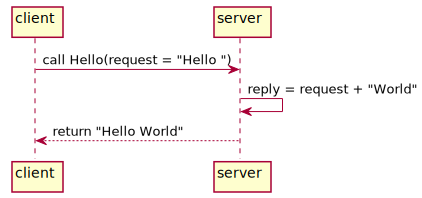

# 3.1. Bắt đầu với RPC

[Remote Procedure Call](https://en.wikipedia.org/wiki/Remote_procedure_call) là phương pháp gọi hàm từ một máy tính từ xa để lấy về kết quả. Trong lịch sử phát triển của internet, RPC đã trở thành một cơ sở hạ tầng không thể thiếu cũng giống như là IPC (Inter Process Communication).

<div align="center">
	
    <br/>
    <span align="center">
		<i>Mô hình giao tiếp client/server trong RPC</i>
	</span>
</div>

## 3.1.1 Chương trình RPC đầu tiên

Thư viện chuẩn của Go chứa gói [net/rpc](https://golang.org/pkg/net/rpc/) dùng để xây dựng chương trình RPC, chương trình RPC đầu tiên của chúng ta sẽ in ra chuỗi "Hello World" được tạo ra và trả về từ máy khác:

<div align="center">
    
</div>

***service/hello.go***: định nghĩa service Hello.

```go
package service

// định nghĩa struct register service
type HelloService struct{}

// định nghĩa hàm service Hello, quy tắc:
// 1. Hàm service phải public (viết hoa)
// 2. Có hai tham số trong hàm
// 3. Tham số thứ hai phải kiểu con trỏ
// 4. Phải trả về kiểu error

func (p *HelloService) Hello(request string, reply *string) error {
    *reply = "Hello " + request
    // trả về error = nil nếu thành công
    return nil
}

```

***server/main.go:*** chương trình phía server.

```go
package main

import (
    "log"
    "net"
    "net/rpc"

    // import rpc service
    "../service"
)

func main() {
    // đăng kí tên service với đối tượng rpc service
    rpc.RegisterName("HelloService", new(service.HelloService))
    // chạy rpc server trên port 1234
    listener, err := net.Listen("tcp", ":1234")
    // nếu có lỗi xảy ra thì in ra
    if err != nil {
        log.Fatal("ListenTCP error:", err)
    }
    // vòng lặp để phục vụ nhiều client
    for {
        // chấp nhận một connection đến
        conn, err := listener.Accept()
        // in ra nếu bị lỗi khi Accept
        if err != nil {
            log.Fatal("Accept error:", err)
        }
        // phục vụ RPC cho client trên một goroutine khác
        // và giải phóng main thread tiếp tục connect client khác
        go rpc.ServeConn(conn)
    }
}
```


***client/main.go:*** mã nguồn client để gọi service Hello.

```go
package main

import (
    "fmt"
    "log"
    "net/rpc"
)

func main() {
    // kết nối đến rpc server
    client, err := rpc.Dial("tcp", "localhost:1234")
    // in ra lỗi nếu có
    if err != nil {
        log.Fatal("dialing:", err)
    }
    // biến chứa giá trị trả về sau lời gọi rpc
    var reply string
    // gọi rpc với tên service đã register, tham số và biến
    err = client.Call("HelloService.Hello", "World", &reply)
    if err != nil {
        log.Fatal(err)
    }
    // in ra kết quả
    fmt.Println(reply)
}
```

Kết quả khi chạy Hello Service :

```sh
$ go run server/main.go
```

Ở một cửa sổ chương trình khác chạy client:

```sh
$ go run client/main.go
Hello World
```

Qua ví dụ trên, có thể thấy rằng việc dùng RPC trong Go thật sự đơn giản.

## 3.1.2 Tạo interface cho chương trình RPC

Trong ví dụ trước, chúng ta đã đặt tất cả những thành phần trên trong ba thư mục **server**, **client**, **service**, nếu bạn muốn refactor lại mã nguồn HelloService, đầu tiên hãy tạo ra một inteface như sau:

***service/hello.go:***

```go
// tên của service, chứa tiền tố pkg để tránh xung đột tên về sau
const HelloServiceName = "path/to/pkg.HelloService"
// interface RPC của HelloService
type HelloServiceInterface = interface {
    // định nghĩa danh sách các function trong service
    Hello(request string, reply *string) error
}
// hàm đăng kí service
func RegisterHelloService(svc HelloServiceInterface) error {
    // gọi hàm register của gói net/rpc
    return rpc.RegisterName(HelloServiceName, svc)
}
```

Sau khi định nghĩa lớp interface của RPC service, client có thể viết mã nguồn để gọi lệnh RPC:

***client/main.go***

```go
// hàm main bên phía client
func main() {
    // kết nối rpc server qua port 1234
    client, err := rpc.Dial("tcp", "localhost:1234")
    // log ra lỗi nếu có
    if err != nil {
        log.Fatal("dialing:", err)
    }
    // biến chứa kết quả sau khi gọi RPC
    var reply string
    // gọi hàm RPC được định nghĩa phía server
    err = client.Call(service.HelloServiceName+".Hello", "hello", &reply)
    // log ra chi tiết lỗi nếu có
    if err != nil {
        log.Fatal(err)
    }
}
```

Tuy nhiên, gọi phương thức RPC thông qua hàm `client.Call` vẫn rất cồng kềnh, để đơn giản chúng ta nên đưa biến connection vào trong struct:

***service/hello.go:***

```go
// struct chứa đối tượng connection
type HelloServiceClient struct {
    *rpc.Client
}
// tạo hàm wrap lời gọi Dial tới server
func DialHelloService(network, address string) (*HelloServiceClient, error) {
    // gọi Dial tới server bên trong
    c, err := rpc.Dial(network, address)
    // trả về rỗng và lỗi nếu có
    if err != nil {
        return nil, err
    }
    // trả về rpc struct và error=nil nếu thành công
    return &HelloServiceClient{Client: c}, nil
}
// wrap lại lời gọi hàm Hello phía client
func (p *HelloServiceClient) Hello(request string, reply *string) error {
    return p.Client.Call(HelloServiceName+".Hello", request, reply)
}
```

Dựa trên các hàm trên, chúng ta sẽ viết lại mã nguồn phía client:

***client/main.go:***

```go
func main() {
    // kết nối RPC server bằng hàm wrapper
    client, err := DialHelloService("tcp", "localhost:1234")
    // log ra lỗi nếu có
    if err != nil {
        log.Fatal("dialing:", err)
    }
    // biến lưu kết quả từ lời gọi RPC
    var reply string
    // thực thi lệnh gọi RPC
    err = client.Hello("World", &reply)
    // log ra lỗi nếu có
    if err != nil {
        log.Fatal(err)
    }
}
```

Cuối cùng, mã nguồn server sẽ được viết lại như sau:

***server/main.go:***

```go
// đối tượng RPC HelloService
type HelloService struct {}
// xây dựng lời gọi RPC
func (p *HelloService) Hello(request string, reply *string) error {
    *reply = "Hello, " + request
    return nil
}
// hàm main phía server
func main() {
    // gọi wrapper đăng ký đối tượng HelloService 
    RegisterHelloService(new(HelloService))
    // lắng nghe kết nối từ phía client
    listener, err := net.Listen("tcp", ":1234")
    // log ra lỗi nếu có (vd: trùng port, v,v..)
    if err != nil {
        log.Fatal("ListenTCP error:", err)
    }
    // vòng lặp tiếp nhận nhiều kết nối client
    for {
        // chấp nhận kết nối từ một client nào đó
        conn, err := listener.Accept()
        // in ra lỗi nếu có
        if err != nil {
            log.Fatal("Accept error:", err)
        }
        // phục vụ kết nối trên một goroutine khác
        // để main thread tiếp tục vòng lặp accept client khác
        go rpc.ServeConn(conn)
    }
}
```

Ở phiên bản refactor, chúng ta sử dụng hàm `RegisterHelloService` để đăng ký RPC service, nó tránh việc trực tiếp đặt tên cho service, và đảm bảo bất cứ đối tượng nào xây dựng các hàm trong Interface của RPC service cũng đều có thể phục vụ lời gọi RPC từ phía client.

[Tiếp theo](ch3-02-pb-intro.md)