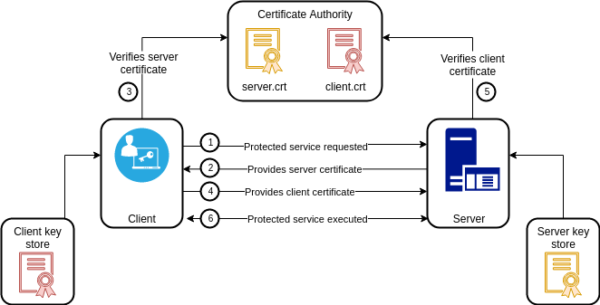

# 4.5 gRPC Nâng cao

Các framework RPC cơ bản thường gặp phải nhiều vấn đề về bảo mật và khả năng mở rộng.

Phần này sẽ mô tả ngắn gọn một số cách xác thực an toàn bằng gRPC. Sau đó giới thiệu tính năng interceptor trên gRPC và cách triển khai cơ chế xác thực Token một cách tốt nhất.

## 4.5.1 Xác thực qua chứng chỉ (certificate)

gRPC được xây dựng dựa trên giao thức HTTP/2 và hỗ trợ TLS khá hoàn thiện. gRPC service trong chương trước chúng ta không hỗ trợ xác thực qua chứng chỉ, vì vậy client `grpc.WithInsecure()` có thể  thông qua tùy chọn mà bỏ qua việc xác thực trong server được kết nối.

<div align="center">

<br/>
<span align="center"><i>Xác thực bằng chứng chỉ</i></span>
    <br/>
</div>

gRPC service không có xác thực chứng chỉ (certificate) sẽ phải giao tiếp hoàn toàn bằng plain-text với client và có nguy cơ cao bị giám sát bởi một bên thứ ba khác. Để khắc phục yếu điểm này, chúng ta có thể sử dụng mã hóa TLS trên server.

Đầu tiên tạo private key và certificate cho server và client riêng biệt bằng các lệnh sau:

```sh
$ openssl genrsa -out server.key 2048
$ openssl req -new -x509 -days 3650 \
    -subj "/C=GB/L=China/O=grpc-server/CN=server.grpc.io" \
    -key server.key -out server.crt

$ openssl genrsa -out client.key 2048
$ openssl req -new -x509 -days 3650 \
    -subj "/C=GB/L=China/O=grpc-client/CN=client.grpc.io" \
    -key client.key -out client.crt
```

Lệnh trên sẽ tạo ra 4 file: *server.key*, *server.crt*, *client.key* và *client.crt*. File private key có phần mở rộng *.key* và được  cần được giữ bảo mật an toàn. File certificate có phần mở rộng *.crt* được hiểu như public key và không cần giữ bí mật.

Với certificate đấy ta có thể truyền nó vào tham số để bắt đầu một gRPC service:

```go
func main() {
    // khởi tạo đối tượng certificate từ file cho server
    creds, err := credentials.NewServerTLSFromFile("server.crt", "server.key")
    if err != nil {
        log.Fatal(err)
    }

    // truyền certificate dưới dạng tham số
    // cho hàm khởi tạo một server
    server := grpc.NewServer(grpc.Creds(creds))

    ...
}
```

Server có thể được xác thực ở client dựa trên chứng chỉ của server và tên của nó:

```go
func main() {
    // client xác thực server bằng cách đưa vào
    // chứng chỉ CA root và tên của server
    creds, err := credentials.NewClientTLSFromFile(
        "server.crt", "server.grpc.io",
    )
    if err != nil {
        log.Fatal(err)
    }

    conn, err := grpc.Dial("localhost:5000",
        grpc.WithTransportCredentials(creds),
    )
    if err != nil {
        log.Fatal(err)
    }
    defer conn.Close()

    ...
}
```

Khi client liên kết với server, trước tiên, nó sẽ yêu cầu chứng chỉ của server, sau đó sử dụng chứng chỉ CA root để xác minh chứng chỉ phía server mà nó nhận được.

Nếu chứng chỉ của client cũng được ký bởi CA root, server cũng có thể thực hiện xác thực chứng chỉ trên client. Ở đây ta sử dụng chứng chỉ CA root để ký chứng chỉ client:

```sh
$ openssl req -new \
    -subj "/C=GB/L=China/O=client/CN=client.io" \
    -key client.key \
    -out client.csr
$ openssl x509 -req -sha256 \
    -CA ca.crt -CAkey ca.key -CAcreateserial -days 3650 \
    -in client.csr \
    -out client.crt
```

Xem [Makefile](../examples/ch4/ch4.5/1-tls-certificate/tls-config/Makefile)

Chứng chỉ root được cấu hình lúc khởi động server:

```go
func main() {
    certificate, err := tls.LoadX509KeyPair("server.crt", "server.key")
    if err != nil {
        log.Fatal(err)
    }

    certPool := x509.NewCertPool()
    ca, err := ioutil.ReadFile("ca.crt")
    if err != nil {
        log.Fatal(err)
    }
    if ok := certPool.AppendCertsFromPEM(ca); !ok {
        log.Fatal("failed to append certs")
    }

    // Server cũng sử dụng hàm `credentials.NewTLS` để tạo chứng chỉ
    creds := credentials.NewTLS(&tls.Config{
        Certificates: []tls.Certificate{certificate},

        // cho phép Client được xác thực
        ClientAuth:   tls.RequireAndVerifyClientCert,

        // chọn chứng chỉ CA root thông qua ClientCA,
        // this is optional!
        ClientCAs:    certPool,
    })

    server := grpc.NewServer(grpc.Creds(creds))
    ...
}
```

Như vậy chúng ta đã xây dựng được một hệ thống gRPC đáng tin cậy để kết nối giữa Client và Server thông qua xác thực chứng chỉ từ cả 2 chiều.

## 4.5.2 Xác thực bằng token

Xác thực dựa trên chứng chỉ được mô tả ở trên là dành cho từng kết nối gRPC. Ngoài ra gRPC cũng  hỗ trợ xác thực cho mỗi lệnh gọi   gRPC, để việc quản lý quyền có thể thực hiện trên các kết nối khác nhau dựa trên user token.

Để hiện thực cơ chế xác thực cho từng phương thức gRPC, ta cần triển khai interface `grpc.PerRPCCredentials`:

```go
type PerRPCCredentials interface {
    // GetRequestMetadata get request về metadata hiện tại,
    // refresh lại token. Hàm này nên được gọi từ transport layer
    // trên mỗi request và dữ liệu phải được điền vào header
    // hoặc trong context. Nếu status code được trả về,
    // nó sẽ được sử dụng làm status cho RPC.
    // uri là URI entry point của request.
    // ctx có thể dùng cho timeout và cancellation.
    GetRequestMetadata(ctx context.Context, uri ...string) (
        map[string]string,    error,
    )

    // RequireTransportSecurity thể hiện cho việc credentials
    // có yêu cầu kết nối bảo mật (TLS) không.
    // Nên là true  để thông tin xác thực không có nguy cơ
    // bị xâm phạm và giả mạo.
    RequireTransportSecurity() bool
}
```

Ta có thể tạo ra struct `Authentication` để xác thực username và password:

```go
type Authentication struct {
    User     string
    Password string
}

// trả về thông tin xác thực cục bộ gồm cả user và password.
func (a *Authentication) GetRequestMetadata(context.Context, ...string) (
    map[string]string, error,
) {
    return map[string]string{"user":a.User, "password": a.Password}, nil
}

// để code được đơn giản hơn nên `RequireTransportSecurity` 
// không cần thiết.
func (a *Authentication) RequireTransportSecurity() bool {
    return false
}
```

Thông tin token có thể được truyền vào như tham số cho mỗi gRPC service được yêu cầu:

```go
func main() {
    auth := Authentication{
        Login:    "gopher",
        Password: "password",
    }

    // đối tượng `Authentication` được chuyển đổi thành tham số
    // của `grpc.Dial` bằng hàm `grpc.WithPerRPCCredentials`
    // vì secure link không được kích hoạt nên cần phải
    // truyền vào `grpc.WithInsecure()` để bỏ qua bước
    // xác thực chứng chỉ bảo mật
    conn, err := grpc.Dial("localhost"+port, grpc.WithInsecure(), grpc.WithPerRPCCredentials(&auth))
    if err != nil {
        log.Fatal(err)
    }
    defer conn.Close()

    ...
}
```

Kế đó trong mỗi phương thức của gRPC server, danh tính người dùng được xác thực bởi phương thức `Auth` của `Authentication`:

```go
type grpcServer struct { auth *Authentication }

func (p *grpcServer) SomeMethod(
    ctx context.Context, in *HelloRequest,
) (*HelloReply, error) {
    if err := p.auth.Auth(ctx); err != nil {
        return nil, err
    }

    return &HelloReply{Message: "Hello " + in.Name}, nil
}

// phương thức thực hiện việc xác thực
func (a *Authentication) Auth(ctx context.Context) error {
    // meta information được lấy từ biến ngữ cảnh `ctx`
    md, ok := metadata.FromIncomingContext(ctx)
    if !ok {
        return fmt.Errorf("missing credentials")
    }

    var appid string
    var appkey string

    if val, ok := md["login"]; ok { appid = val[0] }
    if val, ok := md["password"]; ok { appkey = val[0] }

    // Nếu xác thực thất bại sẽ trả về lỗi
    if appid != a.Login || appkey != a.Password {
        return grpc.Errorf(codes.Unauthenticated, "invalid token")
    }

    return nil
}
```

## 4.5.3 Interceptor

`Grpc.UnaryInterceptor` và `grpc.StreamInterceptor` trong gRPC  hỗ trợ interceptor cho các phương thức thông thường và phương thức stream. Ở đây chúng ta hãy tìm hiểu về việc sử dụng  interceptor cho phương thức thông thường.

Để sử dụng hàm interceptor `filter`, chỉ cần truyền nó vào lời gọi hàm khi bắt đầu một gRPC service:

```go
server := grpc.NewServer(grpc.UnaryInterceptor(filter))
```

<div align="center">
	
	<br/>
	<span align="center"><i>Interceptor với hàm filter</i></span>
	<br/>
</div>

Để hiện thực một interceptor như vậy, ta tạo ra hàm `filter` như sau:

```go
// ctx và req là tham số của phương thức RPC bình thường.
// info chỉ ra phương thức gRPC tương ứng
// hiện đang được sử dụng và tham số handler
// tương ứng với hàm gRPC hiện tại
func filter(ctx context.Context,
    req interface{},
    info *grpc.UnaryServerInfo,
    handler grpc.UnaryHandler,
) (resp interface{}, err error) {
    // ghi log  tham số info
    log.Println("filter:", info)

    // gọi tới phương thức gRPC gắn với `handler`
    return handler(ctx, req)
}
```

Nếu hàm interceptor trả về lỗi thì lệnh gọi phương thức gRPC sẽ được coi là failure. Chúng ta lợi dụng điểm này để thực hiện một số xác thực trên các tham số đầu vào và cả kết quả trả về của Interceptor.

Sau đây là một interceptor có chức năng thêm một exception cho phương thức gRPC:

```go
func filter(
    ctx context.Context,
    req interface{},
    info *grpc.UnaryServerInfo,
    handler grpc.UnaryHandler,
) (resp interface{}, err error) {
    log.Println("filter:", info)

    // nếu có exception thì throw về trước khi
    // gọi tới gRPC
    defer func() {
        if r := recover(); r != nil {
            err = fmt.Errorf("panic: %v", r)
        }
    }()

    return handler(ctx, req)
}
```

Tuy nhiên, chỉ một interceptor có thể được gắn cho một service trong gRPC framework, cho nên tất cả chức năng interceptor chỉ có thể thực hiện trong một hàm. Package go-grpc-middleware trong project opensource [grpc-ecosystem](https://github.com/grpc-ecosystem) có hiện thực cơ chế hỗ trợ cho một chuỗi interceptor dựa trên gRPC.

Một ví dụ về cách sử dụng một chuỗi interceptor trong package go-grpc-middleware:

```go
import "github.com/grpc-ecosystem/go-grpc-middleware"

myServer := grpc.NewServer(
    grpc.UnaryInterceptor(grpc_middleware.ChainUnaryServer(
        filter1, filter2, ...
    )),
    grpc.StreamInterceptor(grpc_middleware.ChainStreamServer(
        filter1, filter2, ...
    )),
)
```

Xem chi tiết: [go-grpc-middleware](https://github.com/grpc-ecosystem/go-grpc-middleware)

## 4.5.4 gRPC kết hợp với Web service

gRPC được xây dựng bên trên giao thức HTTP/2 nên chúng ta có thể đặt gRPC service vào các port giống  như một web service bình thường.

- Với các service không sử dụng TLS:

    ```go
    func main() {
        mux := http.NewServeMux()

        h2Handler := h2c.NewHandler(mux, &http2.Server{})
        server = &http.Server{Addr: ":3999", Handler: h2Handler}
        server.ListenAndServe()
    }
    ```

- Các service sử dụng TLS:

    ```go
    func main() {
        mux := http.NewServeMux()
        mux.HandleFunc("/", func(w http.ResponseWriter, req *http.Request) {
            fmt.Fprintln(w, "hello")
        })

        http.ListenAndServeTLS(port, "server.crt", "server.key",
            http.HandlerFunc(func(w http.ResponseWriter, r *http.Request) {
                mux.ServeHTTP(w, r)
                return
            }),
        )
    }
    ```

- Kích hoạt một gRPC service với các chứng chỉ riêng (xem phần 4.5.1):

```go
func main() {
    creds, err := credentials.NewServerTLSFromFile("server.crt", "server.key")
    if err != nil {
        log.Fatal(err)
    }

    grpcServer := grpc.NewServer(grpc.Creds(creds))

    ...
}
```

Vì gRPC service đã hiện thực phương thức `ServeHTTP` trước đó nên nó có thể được sử dụng  làm đối tượng xử lý định tuyến Web (routing). Nếu  đặt gRPC và Web service lại với nhau, sẽ dẫn đến xung đột link gRPC và link Web. Chúng ta cần phân biệt giữa hai loại service này khi xử lý.

Việc tạo ra các handler xử lý việc routing hỗ trợ cả Web và gRPC có thể thực hiện như sau:

```go
func main() {
    ...

    http.ListenAndServeTLS(port, "server.crt", "server.key",
        http.HandlerFunc(func(w http.ResponseWriter, r *http.Request) {
            // đảm bảo nếu không phải là HTTP/2 thì sẽ không hỗ trợ gRPC
            if r.ProtoMajor != 2 {
                mux.ServeHTTP(w, r)
                return
            }

            // nếu header có chỉ định grpc thì thực thi
            // lời gọi tương ứng
            if strings.Contains(
                r.Header.Get("Content-Type"), "application/grpc",
            ) {
                grpcServer.ServeHTTP(w, r)
                return
            }

            // nếu không thì thực thi server HTTP
            mux.ServeHTTP(w, r)
            return
        }),
    )
}
```

Bạn đọc có thể xem code chi tiết tại [đây](../examples/ch4/ch4.5/4-with-web-services/main.go).

Theo cách này chúng ta có thể cung cấp cả web serive và gRPC chung port cùng một lúc.
