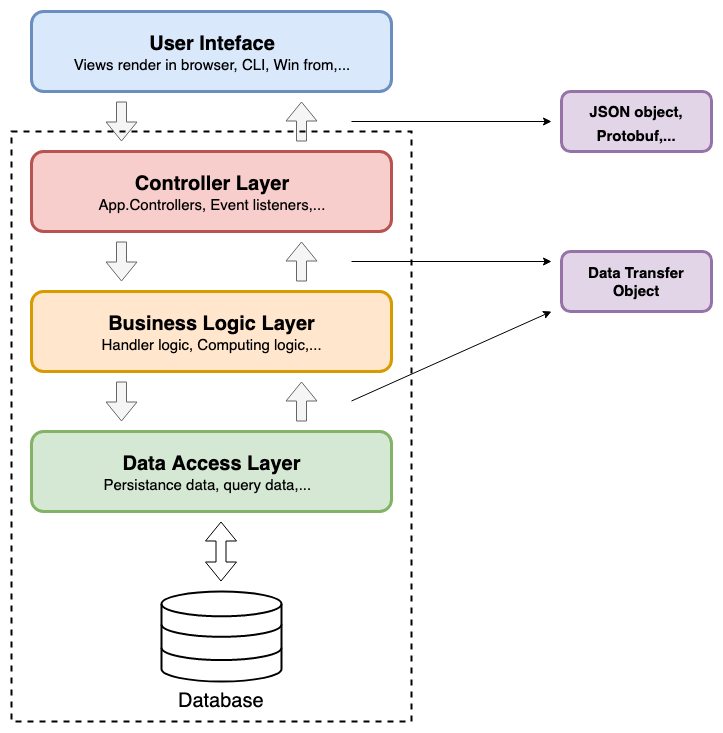

# 4.7. Mô hình của các dự án web

Phần này sẽ trình bày mô hình MVC và đi vào chi tiết các lớp trong một dự án web.

## 4.7.1 Mô hình MVC

MVC frameworks là những framework rất phổ biến trong việc phát triển web, khái niệm MVC được đề xuất đầu tiên bởi [Trygve Reenskaug](https://en.wikipedia.org/wiki/Trygve_Reenskaug) vào năm 1978, chương trình MVC gồm ba thành phần:

* **Model** : là nơi chứa những nghiệp vụ tương tác với dữ liệu hoặc hệ quản trị cơ sở dữ liệu (mysql, mssql... ); nó sẽ bao gồm các class/function xử lý nhiều nghiệp vụ như kết nối database, truy vấn dữ liệu, thêm - xóa - sửa dữ liệu...
* **View** : là nơi có những giao diện như một nút bấm, khung nhập, menu, hình ảnh... nó đảm nhiệm nhiệm vụ hiển thị dữ liệu và giúp người dùng tương tác với hệ thống.
* **Controller** : là nơi tiếp nhận những yêu cầu xử lý được gửi từ người dùng, nó sẽ gồm những class/ function xử lý nhiều nghiệp vụ logic giúp lấy đúng dữ liệu thông tin cần thiết nhờ các nghiệp vụ lớp Model cung cấp và hiển thị dữ liệu đó ra cho người dùng nhờ lớp View.

Trải qua quá trình phát triển, phần back-end của chương trình ngày càng phức tạp. Để quản lý tốt hơn, những phần như thế sẽ thường phân chia ra thành nhiều kiến trúc con. Hình sau là một lưu đồ của hệ thống từ front-end tới back-end:

	
	 
	
		<i>Kiến trúc một dự án web</i>
	

**Vue** và **React** trong hình là hai frameworks front-end phổ biến trên thế giới, bởi vì chúng ta không tập trung nói về nó, do đó cấu trúc front-end của dự án không được nhấn mạnh trên lưu đồ. Thực tế trong vài dự án đơn giản, ngành công nghiệp không hoàn toàn tuân theo mô hình MVC, đặc biệt là phần M và C. Có nhiều công ty mà dự án của họ có rất nhiều phần logic bên trong lớp Controller, và chỉ quản lý phần lưu trữ dữ liệu ở lớp Model.

Tuy nhiên, theo như ý tưởng của người sáng lập MVC thì một business process cũng thuộc một loại "model". Nếu chúng ta đặt mã nguồn thao tác với dữ liệu và business process vào lớp M của MVC, thì lớp M sẽ quá cồng kềnh. Trong những dự án phức tạp, một lớp C hoặc M hiển nhiên là không đủ mà phải có nhiều lớp pure back-end API bên dưới nữa:

## 4.7.2 Mô hình 3 lớp
**Giới thiệu mô hình 3 lớp**

	
	 
	
		<i>Three layer model</i>
	

Mô hình 3 lớp là mô hình khá quen thuộc với chúng ta từ thời còn ngồi ghế nhà trường đại học. Khi chúng ta đã hiểu được tư tưởng của mô hình 3 lớp thì chúng ta có thể biến thể nó cho phù hợp với bài toán hay hệ thống của mình. Ở hình trên là một mô hình 3 lớp theo kinh nghiệm của mình hay làm:

1. **User Interface:** là phần giao diện tương tác với người dùng như web browser, winform, .... Đây là nơi người dùng gửi các yêu cầu RESTful hoặc yêu cầu gRPC tới hệ thống chúng ta.  
2. **Controller Layer:** tương tự như ở trên, là một điểm đầu vào của service, là nơi nhận các gói tin yêu cầu và phản hồi về User Interface. Layer chịu trách nhiệm xử lý các logic routing, kiểm tra tham số, chuyển tiếp request, ...

3. **Business Logic Layer:**  là lớp xử lý chính các business của hệ thống. Khi nhận các yêu cầu từ Controller layer, tuỳ vào loại yêu cầu sẽ có cách xử lý, tính toán khác nhau. Những yêu cầu cần đến dữ liệu hay thay đổi dữ liệu sẽ được lớp này đẩy xuống Data Access Layer tính toán.
4. **Data Access Layer:** là lơp duy nhất có thể truy vấn đến database của service, layer thực hiện các thao tác có liên quan đến dữ liệu như (select, insert, update, delete, ...).

Việc phân chia thành các lớp khác nhau giúp cho chúng ta dễ dàng phát triển và bảo trì hệ thống. Các lớp đảm nhận vai trò khác nhau, giảm sự phụ thuộc giữa các lớp khi hệ thống to ra. Đồng thời các lớp được phân tách giúp chúng ta có thể tái sử dụng lại khá nhiều, tiết kiệm được thời gian xây dựng. Như mình đã nói ở trên, tuy vào nghiệp vụ và hệ thống chúng ta sẽ lựa chọn cho mình một mô hình phù hợp, không nên cứng nhắc quá cho một mô hình. Một khi đã hiểu được ý tưởng thì chúng ta có thể linh hoạt trong việc thiết kế mô hình cho hệ thống.

**Sử dụng thêm middleware**

	
	 
	
		<i>Three layer model</i>
	

Bên cạnh các yêu cầu business logic, hệ thống web còn phải hiện thực phần non-business logic như xác thực token, gửi số liệu báo cáo, kiểm tra tín hợp lệ yêu cầu, ... để tách riêng hai phần này, các lớp middleware được thêm vào.

