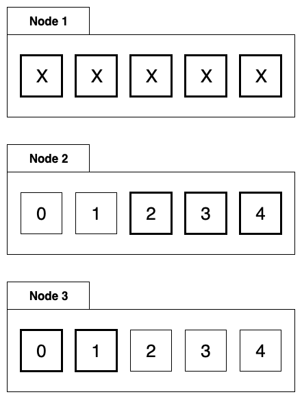

# 5.3 Hệ thống tác vụ có trì hoãn (Delayed Task System)

Khi chúng ta xây dựng hệ thống, chúng ta thường xử lý các công việc trên thời gian thực. Người dùng gửi yêu cầu và sau đó được phản hồi ngay lập tức. Nhưng đôi khi bạn sẽ gặp các công việc không theo thời gian thực, chẳng hạn như đưa ra các thông báo quan trọng tại một thời điểm cụ thể. Hoặc bạn cần làm một cái gì đó cụ thể sau khi người dùng đã thực hiện một vài thứ trong X phút / Y giờ, chẳng hạn như thông báo, phát hành trái phiếu, ...

Nếu quy mô business còn nhỏ, chúng ta có thể sử dụng cơ sở dữ liệu để xử lý các công việc loại này, nhưng các công ty có quy mô lớn hơn sẽ tìm ra các giải pháp linh hoạt hơn để giải quyết vấn đề này.

Nhìn chung, có hai cách để giải quyết vấn đề trên:

1. Hiện thực một hệ thống phân tán để quản lý tác vụ theo thời gian tương tự như [crontab](https://en.wikipedia.org/wiki/Cron).
2. Hiện thực một hàng đợi tin nhắn (message queue) mà hỗ trợ các tin nhắn được định thời trước.

Hai ý tưởng trên đã tạo ra nhiều hệ thống khác nhau, nhưng bản chất là giống nhau. Ta cần hiện thực một bộ đếm thời gian. Bộ đếm thời gian không phải là hiếm trong ngữ cảnh có một server. Ví dụ, chúng ta thường gọi hàm `SetReadDeadline()` khi làm việc với thư viện mạng. Điều này thực sự tạo ra một bộ đếm thời gian (timer) cục bộ. Sau khi hết thời gian quy định, chúng ta sẽ nhận một thông báo từ bộ đếm thời gian nói rằng thời gian đã hết. Tại thời điểm này, nếu việc đọc chưa hoàn thành, thì coi như đã xảy ra sự cố mạng, do đó chúng ta có thể ngừng lại việc đọc.

Hãy bắt đầu với bộ đếm thời gian và khám phá việc hiện thực hệ thống tác vụ có trì hoãn.

## 5.3.1 Hiện thực bộ đếm thời gian

Việc hiện thực các bộ đếm thời gian đã là một vấn đề quen thuộc. Phổ biến là time heap và time wheel.

### 5.3.1.1 Time heap

Time heap là phổ biến nhất và thường được hiện thực bằng min heap. Min heap là một cây nhị phân đặc biệt.

	
	 
	
		<i>Cấu trúc heap nhị phân</i>
	

Những lợi ích của min heap là gì? Trong thực tế, đối với bộ đếm thời gian, nếu phần tử trên cùng lớn hơn thời gian hiện tại, thì tất cả các phần tử trong heap đều lớn hơn thời gian hiện tại. Hơn nữa, chúng ta không cần quan tâm gì về time heap. Độ phức tạp thời gian của việc kiểm tra này là `O(1)`.

Khi ta thấy các phần tử đầu của heap nhỏ hơn thời điểm hiện tại, thì có thể một loạt các sự kiện đã bắt đầu hết hạn, thì các lệnh pop-up và điều chỉnh heap diễn ra. Độ phức tạp thời gian của mỗi lần điều chỉnh heap là `O (LgN)`.

Bộ đếm thời gian tích hợp sẵn của Go được hiện thực với một time heap, nhưng thay vì sử dụng một heap nhị phân, có một giải pháp tốt hơn được sử dụng. Hãy nhìn vào min heap với bốn cạnh trông như thế nào:

	
	 
	
		<i>Quad Cross Stack Structure</i>
	

Bản chất của min heap, node cha nhỏ hơn bốn node con của nó, không có mối quan hệ kích thước đặc biệt giữa các node con.

Không có sự khác biệt giữa thời gian quá hạn của phần tử và điều chỉnh heap trong `heap bốn node` và `heap nhị phân`.

### 5.3.1.2 Time Wheel

	
	 
	
		<i>Time Wheel</i>
	

Khi sử dụng time wheel để hiện thực bộ đếm thời gian, chúng ta cần xác định `tỷ lệ` của mỗi ô. Bánh xe thời gian có thể được tưởng tượng như một chiếc đồng hồ và trung tâm có kim giây theo chiều kim đồng hồ. Mỗi lần chúng ta chuyển sang một ô, chúng ta cần xem danh sách nhiệm vụ được gắn trên ô đó có nhiệm vụ đã đến hạn hay không.

Về mặt cấu trúc, time wheel tương tự như bảng băm, nếu chúng ta định nghĩa thuật toán băm là: **thời gian kích hoạt % số phần tử của time wheel**. Thì đây là một bảng băm đơn giản. Trong trường hợp xung đột băm, một danh sách liên kết được sử dụng.

Ngoài time wheel một lớp, có một số time wheel trong thực tế sử dụng nhiều lớp. Tuy nhiên, tôi sẽ không đi vào chi tiết ở đây.

## 5.3.2 Phân phối công việc

Thông qua cách hiện thực bộ đếm thời gian cơ bản, nếu chúng ta đang phát triển một hệ thống trên một server, chúng ta có thể sử dụng chúng. Nhưng trong chương này chúng ta đang nói về ngữ cảnh hệ thống phân tán, vẫn còn một khoảng cách nhỏ để có thể áp dụng vào hệ thống phân tán.

Chúng ta cần phân bố các công việc theo "thời gian" hoặc "trì hoãn" công việc (về cơ bản cũng là thời gian). Ý tưởng ở đây là:

	
	 
	
		<i>Distributed Task Distribution</i>
	

Mỗi giờ, mỗi instance sẽ vào cơ sở dữ liệu để truy xuất các tác vụ được định thời trước để xử lý trong giờ tiếp theo. Chỉ cần chọn các tác vụ đó với **task_id % shard_count = shard_id**.

Khi các tác vụ thời gian này được kích hoạt, bạn cần thông báo cho phía người dùng. Có hai cách để làm điều này:

1. Đóng gói các thông tin được kích hoạt bởi tác vụ dưới dạng tin nhắn và gửi nó vào một hàng đợi. Phía người dùng chỉ cần lắng nghe hàng đợi tin nhắn này.
2. Gọi một hàm callback do người dùng định cấu hình.

Cả hai cách này đều có ưu điểm và nhược điểm riêng. Nếu bạn sử dụng cách 1, thì khi hàng đợi tin nhắn bị lỗi, toàn bộ hệ thống sẽ `unavailable`. Tất nhiên, hàng đợi tin nhắn thường sẽ có giải pháp đảm bảo `high-availability`. Phần lớn thời gian, chúng ta không phải lo lắng về vấn đề này. 

Thứ hai, nếu hàng đợi tin nhắn được sử dụng ở giữa quá trình của nghiệp vụ business, độ trễ của cho một xử lý  businesssẽ tăng lên. Nếu tác vụ được tính thời gian phải được hoàn thành trong vòng hàng chục millisecond đến vài trăm millisecond sau khi kích hoạt, thì hàng đợi tin nhắn sẽ có những rủi ro nhất định. 

Nếu bạn áp dụng cách thứ hai, nó sẽ tăng gánh nặng của hệ thống tác vụ thời gian. Chúng tôi biết rằng việc thực thi đáng sợ nhất của bộ đếm thời gian trên một server là chức năng callback mất quá nhiều thời gian để thực thi, điều này sẽ ảnh hưởng đến việc thực thi tác vụ tiếp theo. Trong một kịch bản phân tán, mối quan tâm này vẫn được áp dụng. Một callback không tốt có thể trực tiếp kéo toàn bộ hệ thống nhiệm vụ theo thời gian đi xuống. Bên cạnh, chúng ta cũng cần xem xét việc thêm cài đặt thời gian `timeout` cho callback và xem xét cẩn thận khoảng thời gian chờ mà người dùng cấu hình.

## 5.3.3 Cân bằng dữ liệu và cân nhắc tính bất biến

Khi tác vụ của chúng ta thực hiện lỗi do một máy nào đó trong cụm có vấn đề, tác vụ cần được thực hiện lại. Theo chiến lược modulo phía trên, việc phân phối lại các tác vụ chưa được xử lý bởi server này sẽ rắc rối hơn. Nếu đó là một hệ thống đang thực sự chạy, bạn phải chú ý nhiều hơn đến việc cân bằng các nhiệm vụ trong trường hợp có lỗi xảy ra.

Chúng ta có thể tham khảo thiết kế phân phối dữ liệu của [Elaticsearch](https://www.elastic.co/), mỗi dữ liệu của tác vụ có nhiều bản sao. Giả sử có hai bản sao như hình sau:

	
	 
	
		<i>Task Data Distribution</i>
	

Mặc dù có hai node cùng sở hữu một dữ liệu, dữ liệu sẽ có sự phân biệt: `bản chính` hay `bản phụ`. Bản chính là ô vuông có tô đậm viền trong hình và bản phụ có viền bình thường. Một tác vụ sẽ chỉ được thực hiện trên node có bản chính.

Khi có node bị lỗi, ta cần phân phối các dữ liệu của tác vụ trên node này. Ví dụ, node 1 bị treo, chúng ta cùng xem hình sau.

	
	 
	
		<i>Data distribution at fault</i>
	

Dữ liệu của node 1 sẽ được di chuyển đến node 2 và node 3.

Tất nhiên, bạn cũng có thể sử dụng một ý tưởng phức tạp hơn một chút, chẳng hạn như phân chia vai trò của các node trong cụm và node điều phối sẽ phân phối lại các tác vụ trong trường hợp có lỗi. Xem xét tính `high availability`, node điều phối cũng cần 1 đến 2 Node dự phòng để ngăn ngừa tai nạn.

Như đã đề cập, chúng ta sẽ sử dụng hàng đợi tin nhắn để thông báo cho người dùng. Khi sử dụng hàng đợi tin nhắn, nhiều hàng đợi không hỗ trợ [exactly once](https://streaml.io/blog/exactly-once). Trong trường hợp này, chúng ta cần để người dùng tự xử lý việc nhận tin nhắn 2 lần hoặc thiếu tin nhắn (xử lý tạm thời).

[Tiếp theo](ch5-04-search-engine.md)