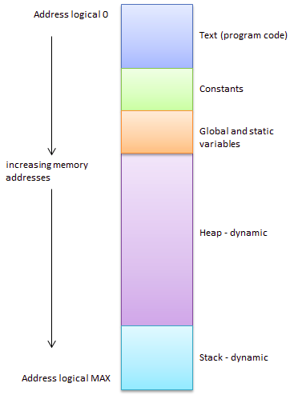
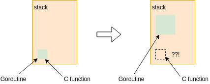

# 2.7. Mô hình bộ nhớ CGO

CGO là cầu nối giữa Go và C, cho phép khả năng tương tác ở cấp độ nhị phân, nhưng chúng ta nên chú ý đến các vấn đề có thể phát sinh do sự khác biệt về mô hình bộ nhớ giữa hai ngôn ngữ.

Trong phần này chúng ta sẽ cùng làm rõ vấn đề đó.

## 2.7.1. Truy cập vùng nhớ của C

Vùng nhớ của không gian ngôn ngữ C khá ổn định, miễn là nó không bị release trước, thì không gian ngôn ngữ Go có thể truy cập được. Truy cập vùng nhớ C trong Go là trường hợp đơn giản và chúng ta đã thấy nó nhiều lần trong các ví dụ trước.

<div align="center">


<br/>
<span align="center"><i>Mô hình bộ nhớ C</i></span>
    <br/>
<br/>
</div>

Do những hạn chế trong hiện thực, chúng ta không thể tạo các slice lớn hơn 2GB bộ nhớ trong Go. Nhưng với sự trợ giúp của cgo, chúng ta có thể tạo ra hơn 2GB bộ nhớ trong môi trường ngôn ngữ C, sau đó chuyển sang slice của ngôn ngữ Go:

```go
package main

/*
#include <stdlib.h>

void* makeslice(size_t memsize) {
    return malloc(memsize);
}
*/
import "C"
import "unsafe"

// tạo ra một slice 4G lớn hơn kích thước bộ nhớ
func makeByteSlize(n int) []byte {
    p := C.makeslice(C.size_t(n))
    return ((*[1 << 31]byte)(p))[0:n:n]
}

// sử dụng để giải phóng slice được tạo từ hàm ngôn ngữ C.
func freeByteSlice(p []byte) {
    C.free(unsafe.Pointer(&p[0]))
}

func main() {
    s := makeByteSlize(1<<32+1)
    s[len(s)-1] = 255
    print(s[len(s)-1])
    freeByteSlice(s)
}
```

Do không gian bộ nhớ ngôn ngữ C ổn định, các slice dựa trên cấu trúc bộ nhớ ngôn ngữ C cũng hoàn toàn ổn định và sẽ không bị di chuyển do những thay đổi trong stack của  Go.

## 2.7.2. C Truy cập vào vùng nhớ Go

Nhiều thư viện trong C/C++ cần xử lý trực tiếp dữ liệu trong bộ nhớ Go thông qua các con trỏ. Do đó có nhiều trường hợp ứng dụng CGO cần chuyển bộ nhớ Go vào các hàm ngôn ngữ C.

Giả sử ta khởi chạy một Goroutine, nó sẽ được cấp một vùng nhớ trên stack, tiếp theo CGO giúp một hàm C có thể truy cập vào vùng nhớ này. Trong quá trình thực thi hàm ngôn ngữ C này, stack của goroutinue này được mở rộng do không đủ không gian, dẫn đến vùng nhớ ngôn ngữ Go ban đầu sẽ được chuyển đến một vị trí mới.

<div align="center">


<br/>
<span align="center"><i>Quá trình hàm C truy cập vùng nhớ của Go</i></span>
    <br/><br/>

</div>

Nhưng tại thời điểm này, hàm ngôn ngữ C không biết rằng vùng nhớ ngôn ngữ Go đã di chuyển vị trí, nó vẫn sử dụng địa chỉ trước đó để vận hành - dĩ nhiên điều này sẽ dẫn tới lỗi vùng nhớ.

Trên đây là một hệ quả (có một số khác biệt trong tình huống thực tế), cho thấy việc truy cập từ C vào bộ nhớ Go rất không an toàn!

### Cách 1: Tạo ra một vùng nhớ của C

Một cách để khắc phục vấn đề trên là sử dụng đặc tính bộ nhớ tĩnh của ngôn ngữ C, trước tiên khởi tạo cùng một kích thước vùng nhớ trong không gian ngôn ngữ C, sau đó chuyển dữ liệu từ Go vào vùng nhớ đó của C. Lúc trả về cũng được xử lý như vậy. Ví dụ sau đây là một triển khai cụ thể của ý tưởng này:

```go
package main

/*
void printString(const char* s) {
    printf("%s", s);
}
*/
import "C"

func printString(s string) {
    // CString tạo ra một vùng nhớ trong C (bằng malloc)
    cs := C.CString(s)
    defer C.free(unsafe.Pointer(cs))

    // truyền địa chỉ vùng nhớ đó vào hàm
    C.printString(cs)
}

func main() {
    s := "hello"

    // truyền chuỗi của Go vào hàm
    printString(s)
}
```

Mặc dù theo cách trên là an toàn nhưng nó lại cồng kềnh và hiệu suất kém (vì phải cấp phát bộ nhớ nhiều lần và sao chép từng phần tử một).

### Cách 2: Không tạo ra vùng nhớ mới

Để xử lý hiệu quả vấn đề chuyển đổi vùng nhớ này, CGO đã đưa ra quy tắc: trước khi hàm ngôn ngữ C trả về (do CGO gọi), CGO đảm bảo rằng vùng nhớ ngôn ngữ Go không tồn tại trong giai đoạn này. Ngay cả khi có thay đổi địa chỉ, hàm ngôn ngữ C giờ có thể truy cập vùng nhớ ngôn ngữ Go một cách tự tin!

Một đoạn code cụ thể như sau:

```go
package main

/*
#include<stdio.h>

void printString(const char* s, int n) {
    int i;
    for(i = 0; i < n; i++) {
        putchar(s[i]);
    }
    putchar('\n');
}
*/
import "C"

func printString(s string) {
    // chuyển đổi từ string s (struct StringHeader) của go
    // sang con trỏ unsafe.Pointer tới địa chỉ vùng nhớ chứa string.
    // quá trình không cần cấp thêm vùng nhớ.
    p := (*reflect.StringHeader)(unsafe.Pointer(&s))
    C.printString((*C.char)(unsafe.Pointer(p.Data)), C.int(len(s)))
}

func main() {
    s := "hello"
    printString(s)
}
```

### Các rủi ro

Nếu hàm của C được gọi cần phải thực thi trong một thời gian dài, điều này sẽ khiến vùng ngôn ngữ Go được hàm tham chiếu tới không thể thay đổi (địa chỉ con trỏ bộ nhớ) trước khi ngôn ngữ C trả về, điều này có thể gián tiếp khiến goroutine tương ứng với stack bộ nhớ của Go không thể thực hiện dynamic scale (tương đương với làm cho groutine này bị block).

Do đó, trong các hàm C phải thực thi trong một thời gian dài (hoạt động CPU phải chờ I/O), bạn cần cẩn thận để xử lý bộ nhớ ngôn ngữ Go.

Phải thận trọng khi truyền địa chỉ vùng nhớ Go vào hàm ngôn ngữ C. Bạn không thể lưu biến tạm và sau đó truyền  gián tiếp cho hàm C được vì CGO chỉ có thể đảm bảo rằng vùng nhớ ngôn ngữ Go truyền vào cho hàm C sẽ không thay đổi, ngoài ra không đảm bảo rằng vùng nhớ sẽ không thay đổi trước khi hàm C được truyền.

Đoạn code sau đây là sai:

```go
tmp := uintptr(unsafe.Pointer(&x))
pb := (*int16)(unsafe.Pointer(tmp))
*pb = 42
```

Khi đối tượng `x` thay đổi địa chỉ (sau khi `tmp` lưu địa chỉ của đối tượng Go), vì `tmp` không phải kiểu con trỏ, nên nó sẽ không được cập nhật thành địa chỉ của vùng nhớ mới khi ngôn ngữ Go thực thi.

Giữ địa chỉ của đối tượng Go trong biến tạm `tmp` không phải con trỏ có tác dụng tương tự như giữ địa chỉ của đối tượng Go trong ngôn ngữ C: nếu địa chỉ vùng nhớ của đối tượng Go ban đầu đã thay đổi, runtime của Go sẽ không thể giải quyết được.

## 2.7.3. Lưu giữ con trỏ tới đối tượng của Go

Một nguyên tắc cơ bản là chúng ta không thể sử dụng bộ nhớ của đối tượng ngôn ngữ Go trực tiếp trong hàm ngôn ngữ C.

Nếu cần truy cập các đối tượng đó bằng ngôn ngữ C, chúng ta có thể ánh xạ (map) chúng từ không gian ngôn ngữ Go sang một kiểu `id`, sau đó gián tiếp truy cập và điều khiển các đối tượng ngôn ngữ Go thông qua `id` này.

Đoạn code sau được sử dụng để ánh xạ đối tượng Go sang `ObjectId` kiểu int:

```go
package main

import "sync"

type ObjectId int32

// quản lý ánh xạ giữa các đối tượng ngôn ngữ Go
// và objectID
var refs struct {
    sync.Mutex
    objs map[ObjectId]interface{}
    next ObjectId
}

func init() {
    refs.Lock()
    defer refs.Unlock()

    refs.objs = make(map[ObjectId]interface{})
    refs.next = 1000
}

// NewObjectId được sử dụng để tạo ObjectId
// liên kết với đối tượng
func NewObjectId(obj interface{}) ObjectId {
    refs.Lock()
    defer refs.Unlock()

    id := refs.next
    refs.next++

    refs.objs[id] = obj
    return id
}

func (id ObjectId) IsNil() bool {
    return id == 0
}

// được sử dụng để decode đối tượng Go ban đầu
func (id ObjectId) Get() interface{} {
    refs.Lock()
    defer refs.Unlock()

    return refs.objs[id]
}

// được sử dụng để giải phóng liên kết
// của ObjectId và đối tượng Go ban đầu
func (id *ObjectId) Free() interface{} {
    refs.Lock()
    defer refs.Unlock()

    obj := refs.objs[*id]
    delete(refs.objs, *id)
    *id = 0

    return obj
}
```

Tập hợp các hàm sau đây được export dưới dạng các interface C và có thể được gọi bằng các hàm ngôn ngữ C:

```go
package main

/*
// tạo một đối tượng chuỗi Go tương ứng;
// giá trị trả về là một id và không thể
// được sử dụng trực tiếp
extern char* NewGoString(char* );
extern void FreeGoString(char* );
extern void PrintGoString(char* );

static void printString(char* s) {
    char* gs = NewGoString(s);
    PrintGoString(gs);
    FreeGoString(gs);
}
*/
import "C"

//export NewGoString
func NewGoString(s *C.char) *C.char {
    gs := C.GoString(s)
    id := NewObjectId(gs)
    return (*C.char)(unsafe.Pointer(uintptr(id)))
}

//export FreeGoString
func FreeGoString(p *C.char) {
    id := ObjectId(uintptr(unsafe.Pointer(p)))
    id.Free()
}

//export PrintGoString
func PrintGoString(s *C.char) {
    // parse id của object thành chuỗi ngôn ngữ Go
    id := ObjectId(uintptr(unsafe.Pointer(s)))
    gs := id.Get().(string)
    print(gs)
}

func main() {
    hello := unsafe.Pointer(C.CString("hello"))
    C.printString((*C.char)(hello))
}
```

Ngay cả khi địa chỉ chuỗi Go thay đổi do quá trình stack scaling gây ra trước lệnh gọi `PrintGoString`, nó vẫn có thể hoạt động bình thường, vì id tương ứng với chuỗi tĩnh trong vùng nhớ của C. Chuỗi thu được bằng cách decode id trong không gian ngôn ngữ Go cũng hợp lệ.

## 2.7.4. Export các hàm C

Golang cấp phát bộ nhớ từ một không gian địa chỉ ảo cố định. Bộ nhớ được cấp phát bởi ngôn ngữ C không thể sử dụng không gian bộ nhớ ảo được dành riêng cho ngôn ngữ Go. Trong môi trường CGO, runtime của Go luôn kiểm tra theo liệu bộ nhớ được trả về  do lệnh export  có được cấp phát bởi ngôn ngữ Go hay không và nếu có sẽ ném ra runtime exception.

Sau đây là một ví dụ về  runtime exception trong CGO:

```go
/*
extern int* getGoPtr();

static void Main() {
    int* p = getGoPtr();
    *p = 42;
}
*/
import "C"

func main() {
    C.Main()
}

//export getGoPtr
func getGoPtr() *C.int {
    return new(C.int)
}
```

`GetGoPtr` trả về một con trỏ của kiểu trong C, nhưng vùng nhớ được cấp phát từ hàm Go, là vùng nhớ được quản lý bởi runtime của Go. Sau đó, chúng ta gọi hàm `getGoPtr` trong hàm main của C và runtime exception sẽ ném ra theo mặc định:

```sh
$ go run main.go
panic: runtime error: cgo result has Go pointer

goroutine 1 [running]:
main._cgoexpwrap_cfb3840e3af2_getGoPtr.func1(0xc420051dc0)
command-line-arguments/_obj/_cgo_gotypes.go:60 +0x3a
main._cgoexpwrap_cfb3840e3af2_getGoPtr(0xc420016078)
command-line-arguments/_obj/_cgo_gotypes.go:62 +0x67
main._Cfunc_Main()
command-line-arguments/_obj/_cgo_gotypes.go:43 +0x41
main.main()
/Users/chai/go/src/github.com/chai2010 \
/advanced-go-programming-book/examples/ch2-xx \
/return-go-ptr/main.go:17 +0x20
exit status 2
```

Exception chỉ ra rằng kết quả được trả về bởi hàm cgo chứa con trỏ tới ngôn ngữ Go. Hoạt động kiểm tra của con trỏ xảy ra trong phiên bản ngôn ngữ C của hàm `getGoPtr`, đây là hàm của ngôn ngữ C và ngôn ngữ Go được CGO tạo ra.

Sau đây là phiên bản ngôn ngữ C của hàm `getGoPtr` được CGO tạo ra (`_cgo_export.c` được xác định trong file được CGO tạo ra):

```c
int* getGoPtr()
{
    __SIZE_TYPE__ _cgo_ctxt = _cgo_wait_runtime_init_done();
    struct {
        int* r0;
    } __attribute__((__packed__)) a;
    _cgo_tsan_release();
    crosscall2(_cgoexp_95d42b8e6230_getGoPtr, &a, 8, _cgo_ctxt);
    _cgo_tsan_acquire();
    _cgo_release_context(_cgo_ctxt);
    return a.r0;
}
```

Trong đó `_cgo_tsan_acquire` là hàm scan con trỏ bộ nhớ được chuyển đổi từ project LLVM, kiểm tra xem kết quả được trả về bởi hàm CGO có chứa con trỏ Go hay không.

Cần lưu ý rằng việc kiểm tra mặc định của con trỏ đối với kết quả được trả về là khá tốn kém, đặc biệt nếu kết quả được trả về bởi hàm CGO là một cấu trúc dữ liệu phức tạp, sẽ mất nhiều thời gian hơn nữa. Nếu bạn đã đảm bảo rằng các kết quả được trả về bởi hàm CGO là an toàn, bạn có thể  tắt thao tác kiểm tra con trỏ bằng cách đặt biến môi trường `GODEBUG=cgocheck=0`.

```sh
$ GODEBUG=cgocheck=0 go run main.go
```

Sau khi tắt `cgocheck` và chạy đoạn code trên, exception  sẽ xuất hiện. Tuy nhiên, cần lưu ý rằng nếu bộ nhớ tương ứng trong ngôn ngữ C được release bởi runtime của Go, nó sẽ gây ra sự cố nghiêm trọng hơn. Giá trị mặc định của `cgocheck` là 1, tương ứng với phiên bản detection đơn giản hoá. Nếu bạn cần hàm detection đầy đủ, bạn có thể đặt `cgocheck` thành 2.

Để biết mô tả chi tiết về các hàm CGO rumtime pointer detection hãy tham khảo tài liệu chính thức của Golang: [package runtime - GoDoc](https://godoc.org/runtime#hdr-Environment_Variables).

[Tiếp theo](ch2-08-c-class.md)