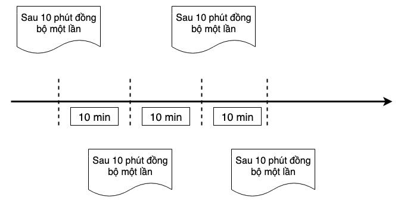

# 6.4 Công cụ tìm kiếm phân tán

Trong chương Web, chúng ta đã biết MySQL có rất nhiều rủi ro. Nó là hệ thống cơ sở dữ liệu đảm bảo tính thời gian thực và tính nhất quán cao, do đó các chức năng của nó được thiết kế để đáp ứng tính nhất quán này. Ví dụ: thiết kế ghi nhật ký trước, index, tổ chức dữ liệu dựa trên cây B+ và transaction dựa trên MVCC.

Cơ sở dữ liệu quan hệ thường được sử dụng để triển khai các hệ thống OLTP. OLTP là gì? Theo wiki định nghĩa:

Trong các kịch bản kinh doanh, sẽ có những kịch bản mà yêu cầu tính thời gian thực không cao (có thể chấp nhận độ trễ vài giây), nhưng lại có độ phức tạp khi truy vấn cao. Ví dụ: trong hệ thống thương mại điện tử WMS, các hệ thống CRM hoặc các dịch vụ khách hàng có kịch bản kinh doanh phức tạp, lúc này ta cần phải tạo ra các hàm truy vấn kết hợp rất nhiều trường khác nhau. Kích thước dữ liệu của hệ thống như vậy cũng rất lớn, chẳng hạn như mô tả hàng hóa trong hệ thống thương mại điện tử WMS, có thể có các trường sau:

> warehouse id, warehousing time, location id, storage shelf id, warehousing operator Id, outbound operator id, stock quantity, expiration time, SKU type, product brand, product category, number of internals

Ngoài các thông tin trên, nếu hàng hóa nằm trong kho. Có thể có id quá trình đang thực hiện, trạng thái hiện tại, v.v.

Hãy tưởng tượng nếu chúng ta đang điều hành một công ty thương mại điện tử lớn với hàng chục triệu đơn hàng mỗi ngày, sẽ rất khó để truy vấn và xây dựng các index thích hợp trong cơ sở dữ liệu này.

Trong CRM hoặc hệ thống dịch vụ khách hàng, thường có nhu cầu tìm kiếm theo từ khóa, bên cạnh đó thì các công ty lớn sẽ nhận được hàng chục ngàn khiếu nại của người dùng mỗi ngày. Từ đó, ta thấy rằng các khiếu nại của người dùng phải có ít nhất 2 đến 3 năm để có thể xử lý xong. Số lượng dữ liệu có thể là hàng chục triệu hoặc thậm chí hàng trăm triệu. Thực hiện một truy vấn dựa trên từ khóa có thể trực tiếp làm treo toàn bộ MySQL.

Lúc này, chúng ta cần một công cụ tìm kiếm để thắng được trò chơi này.

## Công cụ tìm kiếm

Elaticsearch(es) là dẫn đầu trong các công cụ tìm kiếm phân tán opensource, dựa trên việc triển khai Lucene và kết hợp cùng nhiều tối ưu hóa trong quá trình triển khai, vận hành và bảo trì. Xây dựng một công cụ tìm kiếm phân tán ngày nay dễ dàng hơn nhiều so với thời đại trước. Đơn giản chỉ cần cấu hình IP máy khách và cổng.

### Inverted index

Mặc dù es được tạo ra cho mục đích tìm kiếm, nhưng es thường được sử dụng làm cơ sở dữ liệu trong các ứng dụng thực tế, vì tính chất của inverted index. Hiểu đơn giản thì dữ liệu là 1 quyển sách, để tìm kiếm nhanh thì người ta sinh ra 1 cái là mục lục đánh dấu nội dung, thì cái mục lục bản chất giống như việc đánh index vậy.

Việc đánh index có vẻ đơn giản nhưng bên dưới ES làm khá nhiều việc. Mysql thường sẽ đánh theo các trường trong bảng như (name, email …). Tuy nhiên ES sẽ đánh index theo đơn vị là term, cụ thể như sau:

```md
Title (A1) = "Advanced Go Book"
Question (A2) = "What is Go"
Answer (A3) = "Go is simple"
```

Inverted index sẽ như sau:

```md
"Advanced" => {A1}
"Go" => {A1,A2,A3}
"Book" => {A1}
"What" => {A2}
"is" => {A2,A3}
"simple" => {A3}
```

Ta thấy được chuỗi ban đầu là tổ hợp của nhiều Term. Và việc tìm kiếm sẽ dựa trên tổ hợp các term này. Nhưng làm sao ES tách được chuỗi thành các Term? Câu trả lời là ES sử dụng 2 kỹ thuật:

1. N-Gram Morphological Analysis: là kỹ thuật chia các chuỗi to thành các chuỗi con theo trọng số với độ dài N, N = (1..3), ví dụ N = 2 (cấu hình mặc định của ES), khi tách chuối "ADVANCED GO BOOK" ta sẽ được các term như sau:

```md
"ADVANCED GO BOOK" => {"AD","DV","VA","AN","NC","CE","ED","D "," G","GO","O "," B","BO","OO","OK"}
```

2. [Morphological Analysis](<https://en.wikipedia.org/wiki/Morphology_(linguistics)>) là kỹ thuật xử lý ngôn ngữ tự nhiên (National Language Procesing). Đơn giản là kỹ thuât tách các chuỗi thành từ có nghĩa dựa theo ngôn ngữ, ví dụ "ADVANCED GO BOOK" sẽ được phân tích như sau:

```md
"ADVANCED GO BOOK" => {"ADVANCED", "GO","BOOK}
```

### Truy vấn DSL

Khi chúng ta sử dụng es làm cơ sở dữ liệu, chúng ta cần sử dụng truy vấn Bool của nó. Ví dụ:

```json
{
  "query": {
    "bool": {
      "must": [
        {
          "match": {
            "field_1": {
              "query": "1",
              "type": "phrase"
            }
          }
        },
        {
          "match": {
            "field_2": {
              "query": "2",
              "type": "phrase"
            }
          }
        },
        {
          "match": {
            "field_3": {
              "query": "3",
              "type": "phrase"
            }
          }
        },
        {
          "match": {
            "field_4": {
              "query": "4",
              "type": "phrase"
            }
          }
        }
      ]
    }
  },
  "from": 0,
  "size": 1
}
```

Trông khá phực tạp, nhưng ta có thể hiểu đơn giản như sau:

```go
if field_1 == 1 && field_2 == 2 && field_3 == 3 && field_4 == 4 {
    return true
}
```

Login OR trong truy vấn bool:

```json
{
  "query": {
    "bool": {
      "should": [
        {
          "match": {
            "field_1": {
              "query": "1",
              "type": "phrase"
            }
          }
        },
        {
          "match": {
            "field_2": {
              "query": "3",
              "type": "phrase"
            }
          }
        }
      ]
    }
  },
  "from": 0,
  "size": 1
}
```

Code go cho logic trên:

```go
if field_1 == 1 || field_2 == 2 {
	return true
}
```

Các biểu thức theo sau `if` trong các đoạn code Go ở trên để diễn đạt `Boolean Expression`:

```go
4 > 1
5 == 2
3 < i && x > 10
```

`Bool Query` là dùng json để diễn tả Boolean Expression, tại sao sao lại sử dụng nó? Vì json có thể biểu thị cấu trúc cây, code của chúng ta sẽ trở thành AST sau khi được trình biên dịch phân tích cú pháp và trở thành cây cú pháp trừu tượng AST. Boolean Expression ở đây được tạo bởi trình biên dịch Parse và kết quả là một cấu trúc cây, và đây chỉ là một bước nhỏ trong toàn bộ quá trình thực hiện của trình biên dịch.

### Sử dụng client SDK của ES

Khởi tạo:

```go
// 选用 elastic 版本时
// 注意与自己使用的 elasticsearch 要对应
import (
	elastic "gopkg.in/olivere/elastic.v3"
)

var esClient *elastic.Client

func initElasticsearchClient(host string, port string) {
	var err error
	esClient, err = elastic.NewClient(
		elastic.SetURL(fmt.Sprintf("http://%s:%s", host, port)),
		elastic.SetMaxRetries(3),
	)

	if err != nil {
		// log error
	}
}
```

Chèn một document:

```go
func insertDocument(db string, table string, obj map[string]interface{}) {

	id := obj["id"]

	var indexName, typeName string
	// 数据库中的 database/table 概念，可以简单映射到 es 的 index 和 type
	// 不过需要注意，因为 es 中的 _type 本质上只是 document 的一个字段
	// 所以单个 index 内容过多会导致性能问题
	// 在新版本中 type 已经废弃
	// 为了让不同表的数据落入不同的 index，这里我们用 table+name 作为 index 的名字
	indexName = fmt.Sprintf("%v_%v", db, table)
	typeName = table

	// 正常情况
	res, err := esClient.Index().Index(indexName).Type(typeName).Id(id).BodyJson(obj).Do()
	if err != nil {
		// handle error
	} else {
		// insert success
	}
}
```

Lấy dữ liệu:

```go
func query(indexName string, typeName string) (*elastic.SearchResult, error) {
	// 通过 bool must 和 bool should 添加 bool 查询条件
	q := elastic.NewBoolQuery().Must(elastic.NewMatchPhraseQuery("id", 1),
	elastic.NewBoolQuery().Must(elastic.NewMatchPhraseQuery("male", "m")))

	q = q.Should(
		elastic.NewMatchPhraseQuery("name", "alex"),
		elastic.NewMatchPhraseQuery("name", "xargin"),
	)

	searchService := esClient.Search(indexName).Type(typeName)
	res, err := searchService.Query(q).Do()
	if err != nil {
		// log error
		return nil, err
	}

	return res, nil
}
```

Xóa dữ liệu:

```go
func deleteDocument(
	indexName string, typeName string, obj map[string]interface{},
) {
	id := obj["id"]

	res, err := esClient.Delete().Index(indexName).Type(typeName).Id(id).Do()
	if err != nil {
		// handle error
	} else {
		// delete success
	}
}
```

Do bản chất của Lucene, dữ liệu trong công cụ tìm kiếm này là bất biến. Vì vậy nếu bạn muốn cập nhật tài liệu,thực chất việc chèn sẽ diễn ra.

Khi sử dụng es làm cơ sở dữ liệu, bạn cần lưu ý rằng es có hoạt động hợp nhất index, vì vậy phải mất một thời gian để dữ liệu được chèn vào es có thể truy vấn được (cấu hình refresh_interval của es). Vì vậy, không sử dụng es như một cơ sở dữ liệu quan hệ strong consistency.

### Chuyển đổi SQL sang DSL

Ví dụ: chúng ta cần một biểu thức bool `user_id = 1 and (product_id = 1 and (star_num = 4 or star_num = 5) and banned = 1)`, SQL của nó như sau:

```sql
select * from xxx where user_id = 1 and (
	product_id = 1 and (star_num = 4 or star_num = 5) and banned = 1
)
```

DSL trong ES có dạng:

```json
{
  "query": {
    "bool": {
      "must": [
        {
          "match": {
            "user_id": {
              "query": "1",
              "type": "phrase"
            }
          }
        },
        {
          "match": {
            "product_id": {
              "query": "1",
              "type": "phrase"
            }
          }
        },
        {
          "bool": {
            "should": [
              {
                "match": {
                  "star_num": {
                    "query": "4",
                    "type": "phrase"
                  }
                }
              },
              {
                "match": {
                  "star_num": {
                    "query": "5",
                    "type": "phrase"
                  }
                }
              }
            ]
          }
        },
        {
          "match": {
            "banned": {
              "query": "1",
              "type": "phrase"
            }
          }
        }
      ]
    }
  },
  "from": 0,
  "size": 1
}
```

Dù bạn hiểu rõ DSL của ES nhưng vẫn sẽ tốn công để viết được nó. Chúng ta đã biết client SDK của ES nhưng nó cũng không đủ linh hoạt.

Phần WHERE trong SQL là Boolean Expression. Như chúng ta đã biết, bool expresion này tương tự như cấu trúc DSL của ES sau khi được phân tích cú pháp. Vậy của thể chuyển đổi qua lại giữa DSL và SQL không?

Câu trả lời là chắc chắn được. Bây giờ, chúng ta thử so sánh cấu trúc của SQL với cấu trúc của Parse và cấu trúc của DSL của es :

<<<<<<< HEAD
<div align="center">
	
	<br/>
	<span align="center">
		<i>Sự tương ứng giữa AST và DSL</i>
	</span>
</div>
<br/>
=======


*Hình 6-12 Sự tương ứng giữa AST và DSL*
>>>>>>> 039d41a5ffac593cb424dd3bee29b440339ea376

Ta thấy cấu trúc chúng khá giống nhau nên chúng ta có thể chuyển đổi logic của chúng cho nhau. Trước tiên, chúng ta duyệt cây AST theo chiều rộng, sau đó chuyển đổi biểu thức nhị phân thành chuỗi json và tổng hợp nó lại.

Do quá trình khá phức tạp nên ví dụ không được đưa vào bài viết này. Vui lòng tham khảo `github.com/cch123/elasticsql` để biết thêm chi tiết.

## Đồng bộ hóa dữ liệu không đồng nhất

Trong các ứng dụng thực tế, chúng ta hiếm khi ghi dữ liệu trực tiếp vào công cụ tìm kiếm. Một cách phổ biến hơn là đồng bộ hóa dữ liệu từ MySQL hoặc loại databsae khác vào công cụ tìm kiếm. Người dùng của công cụ tìm kiếm chỉ có thể truy vấn dữ liệu mà không thể sửa đổi và xóa nó.

Có hai chương trình đồng bộ hóa phổ biến:

### Đồng bộ dữ liệu theo timestamp

<<<<<<< HEAD
<div align="center">
	
	<br/>
	<span align="center">
		<i>Dựa trên timestamp để đồng bộ hóa dữ liệu</i>
	</span>
</div>
<br/>
=======


*Hình 6-13 Dựa trên timestamp để đồng bộ hóa dữ liệu*
>>>>>>> 039d41a5ffac593cb424dd3bee29b440339ea376

Phương thức đồng bộ hóa này cần phải phù hợp với nhu cầu của doanh nghiệp. Ví dụ, đối với đơn hàng trong hệ thống WMS, chúng ta không cần tính realtime cao và việc xử lý chậm có thể chấp nhận được. Vì vậy, chúng tôi có thể xử lý đơn hàng cứ mỗi 10 phút, logic cụ thể giống câu SQL sau:

```sql
select * from wms_orders where update_time >= date_sub(now(), interval 10 minute);
```

Khi xem xét các giá trị biên, chúng ta nên lấy dữ liệu với khoảng thời gian trùng với một phần khoảng thời gian trước đó:

```sql
select * from wms_orders where update_time >= date_sub(
	now(), interval 11 minute
);
```

Sau khi tăng khoảng thời gian lên 11 phút thì mọi thứ đã ổn hơn. Nhưng rõ ràng, phương pháp này có khá nhiều thiếu soát và có điều kiện về tính chất thời gian. Ví dụ: phái có trường update_time và cập nhật nó mỗi khi tạo hoặc cập nhật, và giá trị thời gian này phải chính xác. Nếu không việc đồng bộ hoá có thể mất dữ liệu.

### Đồng bộ hóa dữ liệu với binlog

<<<<<<< HEAD
<div align="center">
	
	<br/>
	<span align="center">
		<i>Đồng bộ hóa dữ liệu dựa trên binlog</i>
	</span>
</div>
<br/>
=======


*Hình 6-13 Đồng bộ hóa dữ liệu dựa trên binlog*
>>>>>>> 039d41a5ffac593cb424dd3bee29b440339ea376

Canal là opensource của Ali và nó  được dùng để phân tích cú pháp binlog và đồng bộ hóa bởi nhiều công ty. Canal sẽ hoạt động như một thư viện phụ thuộc MySQL, nó sẽ phân tích cú pháp bincode của từng dòng và gửi nó đến hàng đợi tin nhắn theo định dạng dễ hiểu hơn (chẳng hạn như json).

Downstream Kafka consumer chịu trách nhiệm ghi khóa chính tự tăng của bảng dữ liệu upstream dưới dạng id của ES, mỗi khi nhận được binlog, dữ liệu có id tương ứng sẽ được cập nhật mới nhất. Binlog của một Row trong MySQL sẽ cung cấp tất cả các trường của record cho downstream. Vì vậy, trên thực tế, khi đồng bộ hóa dữ liệu, bạn không cần xem xét liệu dữ liệu được chèn hay cập nhật, miễn là bạn có chèn id.

Mô hình này cũng yêu cầu doanh nghiệp tuân thủ một điều kiện của bảng dữ liệu, bảng phải có id khóa chính là duy nhất để đảm bảo rằng dữ liệu chúng ta nhập vào ES sẽ không bị trùng lặp. Khi điều kiện này không được tuân theo, nó sẽ dẫn đến sự trùng lặp dữ liệu khi đồng bộ hóa. 
